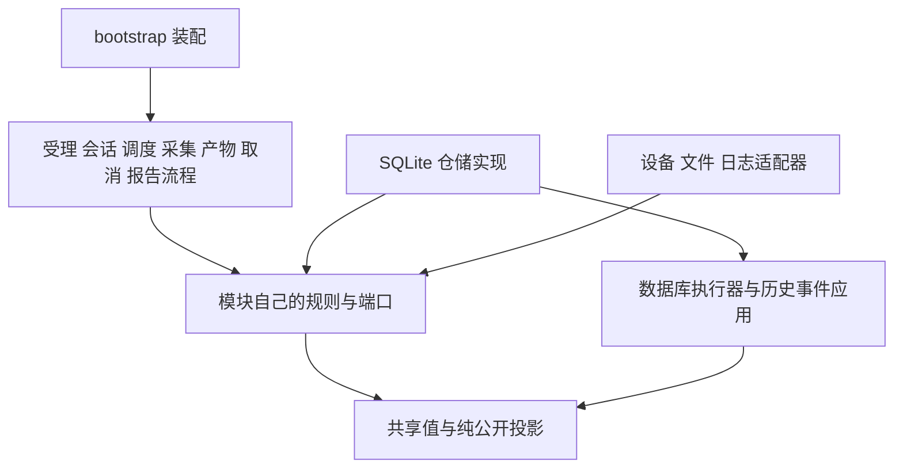

# camctl 模块协作与实施契约

[设计入口](README.md) · [实施路线图与模块计划目录](../superpowers/plans/2026-09-30-camctl-implementation-roadmap.md)

本页组织 camctl 第一版的模块实施边界，供模块计划及执行者共同使用。业务行为、持久化不变量和公开格式由现有专题定义；本页的分页结果契约规定跨模块分页的字段与完成语义。包名、文件位置，以及未由接口契约固定的内部类型和函数签名都是实施建议。调整建议时须同步修改消费者计划，保持业务契约、原子边界和接口完成含义。

模块计划已经按完整职责拆分。执行者先阅读所属计划及其设计依据，再核对所需的前置交付；不要求先把一个模块全部实现完，才开始另一个模块。路线图按任务安排基础接口、首条业务链和后续能力。

任务依赖分为基础交付和后续组合验证。类型、端口及纯规则先按任务中的最窄测试提供，消费者才能实施；任务中注明“消费者实施后”的集成验证，在消费者可运行后执行，并由对应阶段门禁收齐证据。基础交付可被消费者使用，但有集成验证未完成时，该任务不能勾选为全部完成。最终验收任务依赖生产能力，不相互依赖其他模块的最终验收任务。

## 实施范围与统一执行方式

生产代码位于 `apps/camctl/src/camctl`。公共 Schema 和错误机器表示以根 `protocol` 为源；SQL、事件转换、内部整数、报告依赖和 SQLite 运行条件以 `docs/camctl` 对应登记为源。构建可以复制或生成包资源，生成结果不得成为另一份独立维护的清单。

Python 使用 3.11 及以上版本。依赖沿用[既定技术选型](implementation.md#基础技术选型)，具体版本由 `apps/camctl/uv.lock` 接管。SQLite 检查读取 [sqlite-runtime.json](sqlite-runtime.json)，检查 Python 实际链接的运行库；不把 Python 版本或外部 sqlite 命令版本当作证明。

首次包任务建立名为 `test` 的开发依赖组。以下是建议的统一命令，在包任务完成后才可运行：

```bash
uv sync --project apps/camctl --group test
uv run --project apps/camctl --group test pytest apps/camctl/tests/unit -q
uv run --project apps/camctl --group test pytest apps/camctl/tests/integration -q
```

模块任务给出更窄的测试文件命令。先编写用例并确认它因目标行为缺失而失败，再实现，最后确认通过。用例中列出的 `assert` 是必须证伪的断言；测试准备从给定输入和独立预期构造，不能调用被测计算来产生期望值。任务完成后按其门禁审阅，并建议形成一个独立提交；任务依赖与内部路径可以随审阅结果调整。

O6 的真实 C 进程收场和 R9 的真实报告消费者用例分别位于根 `tests/integration/test_camctl_process_recovery.py` 与 `tests/integration/test_camctl_report_contract.py`。其他模块组件测试可以用受领取契约约束的协作者安排文件移动与删除；真实 C 领取及客户端导入由 I4/I5 和上述根用例验证。

单元测试只验证独立语义函数，隔离真实文件、数据库、网络、线程和子进程。真实协作者组合放在组件集成测试；客户端、C 模块和 camctl 的组合放在根 `tests/integration`。第一版软件集成用受真实接口约束的设备替身，真实设备、ARM64 安装、目标性能与物理断电另行联调。

执行计划中的“通过”表示建议的验收条件，不表示生产代码或测试已经存在。首次执行任务时检查依赖交付及实际代码；出现未定义状态、代码事实与计划冲突或需要改变既定协议时，停止受影响任务并报告证据。

## 共享类型与接口归属建议

共享层只保存跨边界确有消费者的值。业务命令、阶段和结果由所属模块定义，SQLite 行、厂商响应和文件句柄不进入通用类型包。

| 类型或接口 | 所有者与含义 |
| --- | --- |
| `ObjectId`、`OperationKey`、`UtcMicros`、`DurationMillis` | `contracts.values`。数据库整数对象身份、操作身份及带单位的精确值；公共 ID 的规范十进制字符串适配集中完成，设备配置名称仍按自身字符串契约使用。 |
| `MonotonicClock`、`ClockPort` | `contracts.clock`。前者提供整数单调纳秒，后者另提供精确 UTC 微秒；读取失败明确表达。实际标准库适配由装配创建，单调读数不跨运行恢复。 |
| `JsonValue`、`MISSING` | `contracts.json_values`。精确的 JSON 类型与字段省略；`MISSING` 与显式 `None` 分开。集合跨线程传递时取得独立所有权。 |
| `HistoryBoundary(txn_id, last_event_id)` | `contracts.history_values`。已经完成的完整历史事务边界；冻结 H、投影读取 C、快照 S 都采用此类型，变量名表达用途。初始化边界按历史规格表达。 |
| `Page[T](items, next_cursor)` | `contracts.pages`。有界批次及继续位置，字段与完成语义遵守下文的[分页结果契约](#分页结果契约)。游标绑定所属查询范围和排序。 |
| `DbOutcome[T]` | `persistence.models`。已完成、确认未执行、确认回滚、结果未知的有约束联合结果；业务拒绝可以包含在已提交结果中。 |
| `DbJob[T]`、`DbExecutor` | `persistence` 的内部执行边界。只有 SQLite 适配器创建完整读操作或事务任务，业务流程通过各自的窄仓储接口调用。 |
| 各模块的 `*Repository` | 所属模块的 `ports.py`。提供完整业务操作；具体 SQLite 实现在 `persistence/repositories`，创建连接和控制事务的责任保持集中。 |
| `AttemptTicket`、`CallOutcome`、`ManagedCall` | `operations`。可靠意图产生的派发凭据、真实调用结束结果和实际调用责任；结果不自动等于动作成功。 |
| `DeviceBinding`、按能力划分的驱动接口、`ReadSession` | `devices`。固定设备及驱动身份、操作证据和源读取会话；接口按声明能力提供，不强制所有设备支持查询或停止。 |
| `FileRef`、`FileObservation`、`SegmentResult`、`PublishResult` | `host_files`。已保存文件归属、实际检查结果、分段范围及同步、移动及目录同步阶段；不保存业务终态。 |
| `WorkFacts`、`SessionOutcome`、`ResponsibilityOwner` | `session`。会话的可靠责任分类、最终结果和取消等待后的接手接口。 |
| `WakeToken`、`ScheduleDecision`、`DispatchGrant` | `scheduling`。检查与等待之间的版本、纯资格决定及经过事务再次核对的授予结果。 |
| `ProjectionInput`、`PublicFragment` | `contracts.public_projection`。单对象及有界依赖的纯公开字段计算；事件变化比较与报告编码共用。实体子集合仍分页取得，不建立整棵对象树。 |
| `GenerationJob`、`GenerationResult`、`FrozenReport` | `reporting`。一次生成调用、已同步文件结果和不再改变的报告依据；生成任务与报告身份分开。 |
| `LogReceipt`、`CopyReceipt` | `logging_runtime`。接纳凭据和独立的副本完成凭据；副本包含触发记录，交付不依赖状态库。 |

每个模块计划在“接口与数据”及具体任务中定义自己拥有的类型和函数。消费者直接导入拥有者的公共接口，不再声明一个看似相同的协议。枚举编号和公共字面量从既有登记取得；新增内部结果分类只在其拥有者维护。

## 分页结果契约

历史查询、报告读取和工作发现通过有界批次交付数据，调用方处理本批后再请求下一批。历史文件查询先检查一批候选，再恢复到报告冻结边界 H 并筛选；本批候选可能全部被排除，而后续候选仍有有效文件。因此，批次结果必须分别表达有效数据与扫描进度，调用方不能根据本批数据是否为空判断结束。

`Page[T]` 只保存 `items` 和 `next_cursor`。它提供只读属性 `exhausted`，满足 `page.exhausted == (page.next_cursor is None)`；该属性不接受构造参数，也不独立保存。具体游标类型和查询函数签名由所属查询接口定义。

| 成功返回的 `items` | 成功返回的 `next_cursor` | 推导的 `exhausted` | 调用方行为 |
| --- | --- | --- | --- |
| 包含本批有效结果。 | 包含有效继续位置。 | `False`。 | 处理本批结果，再从该位置继续读取。 |
| 为空。 | 包含有效继续位置。 | `False`。 | 继续读取，不能把本批筛选为空解释为集合结束。 |
| 包含本批有效结果。 | 为 `None`。 | `True`。 | 先处理本批结果，再结束本次扫描。 |
| 为空。 | 为 `None`。 | `True`。 | 结束本次扫描。 |

读取方只有可靠确认所属扫描范围已经结束时，才返回 `next_cursor=None`。有继续位置表示调用方还须继续检查，不保证下一批一定有有效结果；本批无法确认末尾时，可以返回有效继续位置，由后续读取确认结束。

具体读取接口接收限定的查询范围、继续位置及正整数批量上限，并校验它们的合法性。继续位置绑定所属数据库、查询种类、对象范围、固定读取依据和排序；历史查询的绑定还包括 H 及适用的恢复区间。位置必须沿规定排序方向严格推进，不在不同集合或读取范围间复用。调用方保持查询条件不变，原样交回继续位置；请求中用于表达首次读取的标识，不改变结果中 `None` 表达结束的含义。

需要恢复筛选的历史文件查询以最后检查的候选生成继续位置，不使用最后一个有效结果的位置。候选批次遵守所属查询上限，读取方不为填满有效结果而在一次调用中无界扫描。具体条件见[历史关联文件查询](historical-state-query.md#按历史边界分批查找关联文件)。

读取方在返回前释放实际数据库查询游标并结束相关读事务，交付独立拥有或不可变的数据。续读位置是数据值，不是活动数据库游标。调用方在事务外恢复、编码或处理本批数据；实际查询耗时通过索引和测量验证，批量上限本身不构成固定耗时保证。

数据库读取、必需历史恢复或一致性校验出错时，读取接口返回相应错误，不以空 `Page`、`next_cursor=None` 或部分成功页代替错误。取消按所属任务规则处理，不作为扫描结束。所属对象不存在、必要事实无效或未知，与对象存在但集合为空分别表达，具体结果分类由相应查询接口规定。

报告分页保持同一 H 和固定入选或恢复范围；同一次生成临时让出资源时可以保留续读位置。报告任务失败、取消或进程结束后，按[历史读取生命周期](historical-state-query.md#wal-与分批短读事务)重新生成，不把分页游标作为持久化的报告恢复点。调度工作发现遵守自身的状态读取与资格复核规则，`Page` 不授予设备执行资格，也不自动提供报告查询的一致性保证。

以下伪代码展示消费者的调用过程；具体请求和读取函数由所属模块定义：

```python
request = initial_request
while True:
    page = read_batch(request)
    for item in page.items:
        consume(item)
    if page.exhausted:
        break
    request = replace(request, cursor=page.next_cursor)
```

共享类型单元测试分别验证上述四种成功状态及只读属性。查询适配器和消费者的集成测试验证空有效页继续、最后候选位置、固定范围、游标严格推进、读取错误与取消，以及返回前的数据库资源释放；报告还验证批量变化和并发提交不改变冻结结果。模块计划分别承接这些验证，不在通用 `Page` 中实现业务筛选或数据库访问。

## 依赖与装配

业务规则是同步纯函数。业务流程接收时钟、仓储、设备、文件和日志接口；规则及流程不自行打开 SQLite，不读取全局配置，不寻找全局设备。装配入口创建实际资源并传入流程。

`persistence/repositories` 可以依赖各模块的端口和纯规则；业务模块不能反向依赖 SQLite 适配器。历史事件应用与公开字段计算不能导入报告协调器，报告生成不能导入会话或设备控制。相互合作的流程通过窄端口与持久化事实协调，不能彼此调用内部状态机。



架构验证解析真实导入关系并检查装配及运行行为。注释、别名或一段字符串搜索不能证明依赖成立或不存在。

## 原子操作与副作用交接

业务流程发起完整用例，SQLite 适配器在一次写事务中重新取得可靠旧状态并校验。完整事件集合、当前投影、历史对象目录、报告变化目录及快照进度共同提交。不同模块提供规则和输入，不各自提交自己的一张表。完整目录采用[事务接口](database/transactions.md#写操作目录)。

| 完整用例 | 发起方 | 提交方及必须共同保存的事实 |
| --- | --- | --- |
| 输入、独立 ACK 与 submit 交接 | `acceptance`，由 `session` 提供本次交接模式 | 受理仓储在同一事务内查请求、登记全计划或诊断、处理 ACK，并完成需要的接纳探测。 |
| 首次录像授予及尝试 | `scheduling` 与录像流程 | 启动仓储核对顺序及全部限制，保存活动、启动流程、意图、次数和实际依据；确认提交后才产生派发资格。 |
| 调用及查询结果 | 所属采集、拷贝或清理流程 | 操作仓储核对原身份、归属、实际收场及证据；与适用设备、文件、等待和动作事实共同提交。 |
| 采集最终登记 | `capture` | 采集仓储共同保存适用内部处理结果、文件提升、正式产物、动作及父计划状态。 |
| 文件资格、可靠段和副本准备 | `outputs` | 产物仓储分别完整建档、保存可靠段、保存完整副本并解除来源依赖；每种用例有自己的事务。 |
| 取消及独立收场 | `cancellation` 与目标流程 | 取消仓储先核对完整集合和自身目标，保存逐项生效事实及目标独立责任；目标结果不以发起者仍在等待为前提。 |
| 文件发布 | `outputs`、`reporting` 或日志独立流程 | 普通交付先保存意图，随后移动及同步，最后保存结果；报告和日志按各自规则组织，不共用业务状态机。 |
| 报告冻结、发布与 ACK | `reporting`，ACK 由 `acceptance` 组织 | 冻结取得事务之前的完整 H；发布事实与适用同步及动作完成共同保存；ACK 与输入处理共同提交。 |
| 快照 | `history` | 以原 S 和 S 处计数保存完整自身成员，再按写事务最新计数更新进度；不产生权威业务事件。 |

普通设备调用遵守“提交意图与次数 → 确认提交 → 再检查派发条件 → 调用 → 确认实际收场 → 保存结果”。应急录像停止只在既定资格成立时例外使用内存记录，目标结束后共同补记最终事实；不把例外扩展为普通调用路径。

文件段遵守“取得读取资格 → 写入与同步 → 检查取消资格 → 保存可靠进度 → 确认提交 → 下一段”。数据字节只在源读取端与文件执行线程之间传输，事件循环不逐块中转。

## 状态分类与接手规则

取消等待与实际执行是两个维度。每个数据库、设备、文件或报告任务都保留一个责任拥有者，直到实际阶段及结果确认；接手动作须先登记到会话监督器，再解除原等待，不能在取消异常处理里临时创建无监督任务。

| 实际阶段 | 等待者继续等待 | 等待者取消或会话收尾 |
| --- | --- | --- |
| 尚未入队或派发 | 正常争取资格 | 只有确认以后不会执行，才能返回未执行。 |
| 派发与撤回仍在竞争 | 等待唯一判定 | 保留责任，不能先宣称撤回成功。 |
| 已开始、尚无结束结果 | 等待实际完成 | 接手方继续跟踪；停止新增普通步骤，保留实际占用。 |
| 结果可靠成功或失败 | 保存及消费真实结果 | 同样保存及消费真实结果，只推进取消后允许的步骤。 |
| 数据库提交未知 | 停止依赖步骤，按原操作身份核实 | 接手方继续核实，取消不能把未知变成回滚。 |
| 操作实际结束，事实与通知已处理 | 释放适用资源 | 才能完成所属责任及资源关闭。 |

提交未知时必须核对 `operation_key`、输入、阶段和目标。只有可靠确认原事务不存在且不可能迟到提交，才按原业务资格考虑重做。业务拒绝、数据库错误、查询结果未知、记录不存在、无效记录、尚未完成和有效空集合分别表示。

会话与报告有不同的故障边界：报告生成及文件失败保留责任并允许可靠的普通业务继续；数据库读取、历史解释或提交失效进入状态库错误；日志通道和副本失败按各自规则处理。每个计划的异常捕获、默认值、跳过和清理任务都须审计这些分类。

## 模块交付与组合门禁

一个模块通过自己的单元及组件集成门禁，只证明本模块契约。路线图中的业务链还须核验消费者接入、整个原子事务、通知交接、迟到结果、失败重试及重启后的可观察结果。

每项任务记录四种证据：对应的正式契约和验收条目；实际实现文件与接口；先失败后通过的用例及命令；尚未核验的部署或设备前提。生产完成、软件组合通过和目标部署通过分别判断。

跨模块计划引用任务编号表示依赖。例如先完成公共类型、历史事件应用及数据库事务内核，再实现受理；历史查询与报告生成互为消费者时，先固定读取类型，再分别实现，最后通过真实组合门禁。不能把消费者整个模块作为提供者的前置条件，形成无法执行的循环。
