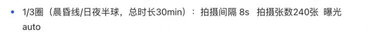
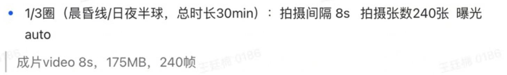

# 相机控制交接资料整理

来源：`tmp/相机控制-tmp.xlsx`，工作表 `Sheet1`。本文件按设备和任务整理会议记录、任务要求、厂商命令及待核实事项。[原文转录](camera-control-source.md)保留全部非空单元格、图片、删除线和来源位置。

原表使用 `Action`、`Action6`，以及 `OSMO 360`、`OSMO360II`、`OSMO 360 II` 等名称。本稿分别以“Action / Action6”和“OSMO 360 / 360 II”作为分组标题；名称是否对应同一具体硬件及固件版本，原表没有给出完整说明。

## 阅读约定

- 原表是口头会议的随手记录。整理时提取任务意图和具体命令；参考数值、设置说明及其适用条件不能直接作为完整设备契约，需核对的细节由用户后续与提供方确认。
- **任务要求**：原表希望完成的拍摄任务或参考参数，不直接视为设备支持范围。
- **提供的命令或说明**：原表给出的调用文本和操作说明；命令未在本次整理中执行，原表也没有提供完整返回值与测试记录。
- **原表划线，效力待确认**：保留划线内容。用户已确认目前无法判断删除线是否表示作废，不能自行按有效或无效处理。
- **整理计算**：根据原表数值作出的算术核对，单独注明；不据此推导厂商协议或改写命令。

命令保留原有参数、大小写及 `0x` 前缀形式，去除用于排版的行首尾空白。Action 段多给出相机内的 shell 命令，OSMO 段多带主机侧的 `adb shell` 前缀。表中不同参数选项是候选调用，不是一份应依次执行全部命令的脚本。后续封装应明确调用位置、前置条件和互斥选择。

原表中的 `IOS` 在解释文字中按上下文整理为 ISO；命令字节不变。表中的 `T0` 为任务指定的开始时刻，延时摄影的“任务持续时间”与最终成片的“视频时长”分别列出。

## 资料概览

| 设备分组 | 任务 | 已提供内容 | 主要缺口或差异 |
| --- | --- | --- | --- |
| Action / Action6 | 普通录像 | 模式、8K/4K 与 30 fps、画面及曝光设置、开始/停止、存储路径 | 开始录像、码率、F4.0 命令有删除线；成功判据和文件查询未给出具体接口 |
| Action / Action6 | 静止延时摄影 | 4K/30 fps、三组间隔与时长样例、视频与照片输出组合、开始命令 | 未给出独立的延时停止命令；部分任务时长、间隔与张数不一致 |
| OSMO 360 / 360 II | 全景录像 | 模式、8K/30 fps、曝光、码率、开始/停止、文件拉取 | FOV、增稳、光圈和码率的要求与提供方说明有差异；部分内容被划线 |
| OSMO 360 / 360 II | 全景静止延时摄影 | 8K/30 fps、时长候选、三组任务样例、开始/停止 | 100 分钟任务备注要求改为 2 小时；自动曝光命令与通用段不同；码率描述不一致 |

这份资料没有给出独立的单张拍照命令。延时任务中提到保存照片，不等同于已经提供单张拍照的完整控制接口。

## “9.9 会议”记录

来源：[第 1—16 行](camera-control-source.md#row-1)。原表没有注明会议年份。

### 时间、文件编号与编码

| 事项 | 原表内容 | 整理说明 |
| --- | --- | --- |
| RTC | “RTC扣掉，所有定时开拍功能去除” | 后文仍有指定时刻开机、开拍的要求；需区分外部调度与相机内部定时功能，不能据后文推定相机仍提供定时接口 |
| 文件编号 | 素材 index 递增，index 满后生成新文件夹 | 文件名、编号位数、上限、新目录命名及删除后的编号规则未补齐；B8 要求补充文件与文件夹逻辑 |
| 编码 | “都是HEVC，H265不可选择” | 原文用词如此；保留为编码固定、不可选择的交接说明，不据此补充其他编码选项 |

原表对去除 RTC 后的文件 index 提出如下测试，**没有填写测试结果**：

1. 上电，通过 ADB 录制 5 个视频，下电。
2. 再次上电，通过 ADB 删除 2 个视频，下电。
3. 再次上电，通过 ADB 录制 2 个视频，检查文件 index 是否重复。

### 码率和图片大小记录

| 来源 | 场景 | 记录值 |
| --- | --- | --- |
| [B11](camera-control-source.md#b11) | Action6，8K/30 fps 普通录像 | 高码率 130 Mbps；标准码率 95 Mbps |
| [B12](camera-control-source.md#b12) | Action6，4K/30 fps 延时视频 | 80 Mbps |
| [B13](camera-control-source.md#b13) | Action6，4K/30 fps、16:9 静止延时的 RAW/JPEG | 图片大小“参考4K拍照大小”，未给出数值 |
| [B15](camera-control-source.md#b15) | OSMO360II，8K/30 fps 普通录像 | 170 Mbps，注明“双球” |
| [B16](camera-control-source.md#b16) | OSMO360II，8K/30 fps 静止延时 | 300 Mbps，注明“双球” |
| [C124](camera-control-source.md#c124) | OSMO，全景 8K/30 fps | 原文“码率 175M　90Mbps*2” |
| [C125](camera-control-source.md#c125) | OSMO，全景 8K 延时 | 300 Mbps、37.5 MB/s，另有“小于10秒”备注，所指对象未说明 |
| [B143、C143](camera-control-source.md#row-143) | OSMO，全景录像参考参数与提供方说明 | 参考参数“最高120 Mbps，待确认或实测”被划线；提供方写高码率 175 Mbps |
| [C171、A180](camera-control-source.md#row-171) | OSMO，全景延时及任务示例 | 写为 video、175 Mbps |

OSMO 的 170、175、`90×2`、300 Mbps 以及“双球”的统计口径尚未统一。本稿保留各自场景与来源，不选择其中一个作为正式码率。

## Action / Action6 普通录像

来源：[第 20—57 行](camera-control-source.md#row-20)。

### 任务要求

在指定时刻前进入视频模式并完成参数设置，于 `T0` 开始，经过 `X` 秒停止。用途为单镜头视频素材，需求描述为 5—20 秒；参考执行流程举例 `T0 + 8s` 停止。上下电由 TX2 与相机之间的外部硬件控制，不涉及 ADB。

用户已确认，5—20 秒只是参考时长，不作为执行计划的时长限制；8 秒也是流程示例。正式参数契约应另行定义时长的取值规则，不从这些会议样例推导最小值、最大值或默认值。

| 参考项 | 原表要求 |
| --- | --- |
| 分辨率与帧率 | 8K、16:9、7680×4320、30 fps；提供方另列 4K/30 fps 命令 |
| 色彩 | D-Log M |
| FOV（视角） | Wide / Natural Wide / Standard，按任务选择 |
| 防抖 | off / RockSteady |
| 曝光 | ISO 800、快门 1/60 s、白平衡 5200 K |
| 曝光补偿 | +0 EV；ISO 与快门手动锁定时，仅作为目标值或记录项 |
| 光圈 | f/2.8 / f/4.0；其中 F4.0 的命令被划线 |
| 码率 | 标准或高码率；命令被划线 |

### 模式、分辨率与画面设置

| 设置 | 相机内命令 | 来源 |
| --- | --- | --- |
| 切换视频模式 | `dji_mb_ctrl -R diag -g 1 -t 0 -s 2 -c 0xe1 01` | D27 |
| 8K、16:9、30 fps | `dji_mb_ctrl -R diag -g 1 -t 0 -s 2 -c 18 3703000000` | D28 |
| 4K、16:9、30 fps | `dji_mb_ctrl -R diag -g 1 -t 0 -s 2 -c 18 1003000000` | D29 |
| 打开 Pro 模式 | `dji_mb_ctrl -R diag -g 1 -t 0 -s 2 -c 8e 010100000101` | D30 |
| D-Log M | `dji_mb_ctrl -S test -R diag -g 1 -t 0 -s 2 -c 42  3d` | D31 |
| Wide | `dji_mb_ctrl -R diag -g 1 -t 0 -s 2 -c 8e 010109000101` | D32 |
| Natural Wide | `dji_mb_ctrl -R diag -g 1 -t 0 -s 2 -c 8e 010109000105` | D33 |
| Standard | `dji_mb_ctrl -R diag -g 1 -t 0 -s 2 -c 8e 010109000102` | D34 |
| 关闭增稳 | `dji_mb_ctrl -R diag -g 1 -t 0 -s 2 -c 8e 010108000100` | D35 |
| RockSteady | `dji_mb_ctrl -R diag -g 1 -t 0 -s 2 -c 8e 010108000101` | D36 |

分辨率和帧率由同一条命令组合设置。原表未提供任意组合的编码规则或其他帧率列表。

### 曝光设置

| 设置 | 相机内命令 | 来源 |
| --- | --- | --- |
| M 档曝光 | `dji_mb_ctrl -R diag -g 1 -t 0 -s 2 -c 1E 0400` | D37 |
| Auto 档曝光 | `dji_mb_ctrl -R diag -g 1 -t 0 -s 2 -c 1E 0100` | D38 |
| M 档 ISO 100 | `dji_mb_ctrl -R diag -g 1 -t 0 -s 2 -c 2a 03` | D39 |
| M 档 ISO 200 | `dji_mb_ctrl -R diag -g 1 -t 0 -s 2 -c 2a 04` | D40 |
| M 档 ISO 400 | `dji_mb_ctrl -R diag -g 1 -t 0 -s 2 -c 2a 05` | D41 |
| M 档 ISO 800 | `dji_mb_ctrl -R diag -g 1 -t 0 -s 2 -c 2a 06` | D42 |
| M 档 ISO 1600 | `dji_mb_ctrl -R diag -g 1 -t 0 -s 2 -c 2a 07` | D43 |
| M 档 ISO 3200 | `dji_mb_ctrl -R diag -g 1 -t 0 -s 2 -c 2a 08` | D44 |
| M 档快门 1/60 s | `dji_mb_ctrl -R diag -g 1 -t 0 -s 2 -c 28 013C8000` | D45 |
| 手动白平衡 5200 K | `dji_mb_ctrl -S test -R diag -g 1 -t 0 -s 2 -c 0x2c 0634000000` | D46 |
| Auto 档 +0 EV | `dji_mb_ctrl -S test -R diag -g 1 -t 0 -s 2 -c 0x2e 10` | D47 |
| Auto 档 −0.7 EV | `dji_mb_ctrl -S test -R diag -g 1 -t 0 -s 2 -c 0x2e 0e` | D48 |
| Auto 档 +0.7 EV | `dji_mb_ctrl -S test -R diag -g 1 -t 0 -s 2 -c 0x2e 12` | D49 |
| F2.8 | `dji_mb_ctrl -S test -R diag -g 1 -t 0 -s 2 -c 0x26 1801` | D50 |
| F4.0；**原表划线，效力待确认** | `dji_mb_ctrl -S test -R diag -g 1 -t 0 -s 2 -c 0x26 9001` | D51 |

### 码率、开始与停止

以下两条码率命令来自 [D52](camera-control-source.md#d52)，**整格被划线，效力待确认**：

```sh
simulate_device -s bitrate 1  #标准码率
simulate_device -s bitrate 2  #高码率
```

| 操作 | 相机内命令 | 来源与状态 |
| --- | --- | --- |
| 开始录像 | `dji_mb_ctrl -R diag -g 1 -t 0 -s 2 -c 02 01` | D53；**原表划线，效力待确认** |
| 停止录像 | `dji_mb_ctrl -R diag -g 1 -t 0 -s 2 -c 02 00` | D54；注明录像时间由外部脚本控制 |

结束后的要求是回传状态，并记录文件名、大小、时长、时间戳、轨道位置、姿态、Pan / Tilt / Roll、FOV 与曝光参数。提供方只补充了检查存储目录和拉取文件的方法；这些元数据分别从哪里读取，尚未列明。

## Action / Action6 静止延时摄影

来源：[第 59—112 行](camera-control-source.md#row-59)。

### 任务与输出要求

公共需求为每隔 `X` 秒采集一张照片，执行 90 分钟或更久，在达到 240 张或更多后结束。原表特别提出：如果使用 10 秒长曝光，拍摄间隔需要大于曝光时间；没有给出长曝光的具体配置命令。

| 样例 | 间隔 | 任务持续时间 | 曝光要求 | 输出要求与提供内容 |
| --- | --- | --- | --- | --- |
| 基础任务，第 63—84 行 | 30 s | 90 min | Pro、M 档、ISO 800、1/60 s、5200 K | 要求保留原始照片；提供 video+RAW 和 video+JPEG 命令 |
| 轨道一圈，第 87—98 行 | 25 s | 100 min | Auto，ISO 范围默认 | 图片标题写 video+JPEG、码率待确认；正文列 video+RAW，另给 video+JPEG 和仅 video 选项 |
| 1/3 圈，第 101—112 行 | 8 s | 30 min | Auto，ISO 范围默认 | 正文列 video+RAW，另给 video+JPEG 和仅 video 选项；图片要求 240 张 |

三组均提供 4K/30 fps 设置。基础任务中的“普通视频色彩”要求和说明被划线；D75 写“默认普通色彩，不支持”，没有提供色彩切换命令。

### 公共设置和触发

| 操作 | 相机内命令 | 来源 |
| --- | --- | --- |
| 进入静止延时摄影 | `dji_mb_ctrl -S test -R diag -g 1 -t 0 -s 2 -c e1 02` | D65、D89、D103 |
| 设置 4K/30 fps | `dji_mb_ctrl -R diag -g 1 -t 0 -s 2 -c 18 1003000000` | D66、D90、D104 |
| Auto 曝光，ISO 范围默认 | `dji_mb_ctrl -S test -R diag -g 1 -t 0 -s 2 -c 0x1e 0100` | D94、D108 |
| 开始延时摄影 | `dji_mb_ctrl -R diag -g 1 -t 0 -s 2 -c 01 01` | D80、D98、D112 |

基础任务还提供 Pro、M 档、ISO 800、快门 1/60 s 和白平衡 5200 K 命令，分别与普通录像表中的对应命令相同，来源为 D70—D74。原表要求达到任务时长或收到停止指令后结束，但 **Action 延时摄影段没有填写停止命令**，不能直接将普通录像的停止命令当作该接口。

### 间隔、持续时间与输出组合命令

这些设置被打包在 `-c 6c` 的负载中。下表只记录已有样例，不反推通用字节编码规则。

| 设置说明 | 相机内命令 | 来源 |
| --- | --- | --- |
| 30 s / 90 min；该行未注明输出类型 | `dji_mb_ctrl -R diag -g 1 -t 0 -s 2 -c 6c 0400002c01181500000000000000000000` | D69，对应第 68、69 行 |
| 30 s / 90 min，video+RAW | `dji_mb_ctrl -R diag -g 1 -t 0 -s 2 -c 6c 0400032c01181500000000000000000000` | D76 |
| 30 s / 90 min，video+JPEG | `dji_mb_ctrl -R diag -g 1 -t 0 -s 2 -c 6c 0400022c01181500000000000000000000` | D77 |
| 25 s / 100 min，仅 video | `dji_mb_ctrl -R diag -g 1 -t 0 -s 2 -c 6c 040000fa00701700000000000000000000` | D92、D97 |
| 25 s / 100 min，video+RAW | `dji_mb_ctrl -R diag -g 1 -t 0 -s 2 -c 6c 040003fa00701700000000000000000000` | D95 |
| 25 s / 100 min，video+JPEG | `dji_mb_ctrl -R diag -g 1 -t 0 -s 2 -c 6c 040002fa00701700000000000000000000` | D96 |
| 8 s / 30 min，仅 video | `dji_mb_ctrl -R diag -g 1 -t 0 -s 2 -c 6c 0400005000080700000000000000000000` | D106、D111 |
| 8 s / 30 min，video+RAW | `dji_mb_ctrl -R diag -g 1 -t 0 -s 2 -c 6c 0400035000080700000000000000000000` | D109 |
| 8 s / 30 min，video+JPEG | `dji_mb_ctrl -R diag -g 1 -t 0 -s 2 -c 6c 0400025000080700000000000000000000` | D110 |

### 图片中的任务补充

第 87 行图片：Action6 延时任务示例，标题写 **video+JPEG、码率待确认**；轨道一圈、100 min、间隔 25 s、240 张、Auto 曝光。


第 101 行图片：1/3 圈，晨昏线或日夜半球；30 min、间隔 8 s、240 张、Auto 曝光。



## OSMO 360 / 360 II 全景录像

来源：[第 120—150 行](camera-control-source.md#row-120)。

### 任务要求及差异

“特殊 BTS 镜头”任务要求：指定时刻启动 OSMO360II 全景视频拍摄，延迟 3—5 秒后由 Action6 步进电机向前推，再结束拍摄。步进电机如何控制、相机与电机如何协同，原表没有给出命令。

录像参考参数为 8K、2:1、7680×3840、30 fps，D-Log M，ISO 800、快门 1/60 s、白平衡 5200 K。参考结束点为 `T0 + 8s`，提供方注明录像时间由外部脚本控制。

| 项目 | 任务要求或设置描述 | 提供方内容与状态 |
| --- | --- | --- |
| 编码 | B131 写 `MP4 / HEVC`，其中只有 `MP4 /` 被划线 | C131“支持HEVC，不涉及”整格被划线；会议记录另写固定 HEVC |
| FOV | Wide / Natural Wide / Standard，全景可以不设；要求与 C133 描述均被划线 | D133 仍列标准、广角、超广角三条命令；名称与要求不完全一致，适用范围未说明 |
| 增稳 | RockSteady / RockSteady+、8K 不使用 HorizonSteady；要求被划线 | C134“RS+不推荐”也被划线；D134 明确写“不支持增稳调节” |
| 光圈 | 优先 f/2.0，可切换 f/2.8、f/4.0；要求被划线 | “无F2.0选项”“102 不支持 光圈调节”“设置F2.8/F4.0”均被划线，未给出命令；`102` 的含义未说明 |
| 码率 | “最高120 Mbps，实际值待确认或实测”被划线 | C143 提供 175 Mbps 高码率说明，称可在触发前配置；D143 给出设置命令 |
| 定时 | 预热、指定时间开机和开拍的 B145—B147、C146—C147 被划线 | D147 写“录制时间由外部脚本控制”；相机内部定时接口未提供 |

所有删除线均按“原表划线，效力待确认”处理。任务对 FOV、增稳或光圈的要求，不能覆盖提供方明确写出的限制或缺失接口。

### 模式、分辨率与色彩

进入全景视频模式的两条命令，来源 D128：

```sh
adb shell dji_mb_ctrl -S test -R diag -g 1 -t 0 -s 2 -c 0x8e 01013f000101
adb shell dji_mb_ctrl -R diag -g 1 -t 0 -s 2 -c e1 38
```

设置 8K/30 fps，来源为合并单元格 D129:D130：

```sh
adb shell simulate_device -s BaseFormat 6 69 0
```

打开 Pro 并设置 D-Log M，来源 D132：

```sh
adb shell dji_mb_ctrl -R diag -g 1 -t 0 -s 2 -c 8e 010100000101
adb shell dji_mb_ctrl -R diag -g 1 -t 0 -s 2 -c 42 3d
```

FOV 命令文本来自 D133。其对应需求和设置说明被划线，以下仅保留命令与原始名称，**不确定是否适用于本任务的全景模式**：

| 原始名称 | 命令 |
| --- | --- |
| 标准 | `adb shell dji_mb_ctrl -R diag -g 1 -t 0 -s 2 -c 8e 010109000102` |
| 广角 | `adb shell dji_mb_ctrl -R diag -g 1 -t 0 -s 2 -c 8e 010109000101` |
| 超广角 | `adb shell dji_mb_ctrl -R diag -g 1 -t 0 -s 2 -c 8e 010109000100` |

### 曝光、码率与录像触发

| 操作 | 主机侧命令 | 来源 |
| --- | --- | --- |
| M 档曝光 | `adb shell  dji_mb_ctrl -r -S test -R diag -g 1 -t 0 -s 2 -c 1e 0400` | D135 |
| Auto 档曝光 | `adb shell dji_mb_ctrl -r -S test -R diag -g 1 -t 0 -s 2 -c 1e 0100` | D135 |
| M 档 ISO 800 | `adb shell  dji_mb_ctrl -r -S test -R diag -g 1 -t 0 -s 2 -c 2A 06` | D136 |
| M 档快门 1/60 s | `adb shell  dji_mb_ctrl -r -S test -R diag -g 1 -t 0 -s 2 -c 28 013c8000` | D137 |
| 白平衡 5200 K | `adb shell  dji_mb_ctrl -R diag -g 1 -t 0 -s 2 -c 2c 0634000000` | D138 |
| 获取 M 档 EV | `adb shell  dji_mb_ctrl -R diag -g 1 -t 0 -s 2 -c 2f` | D139；未给出响应格式 |
| Auto 档 +0 EV | `adb shell  dji_mb_ctrl -R diag -g 1 -t 0 -s 2 -c 2e 10` | D140 |
| 设置高码率，原表描述为 175 Mbps | `adb shell  simulate_device -s DeviceRecordRecSettingBitRate 2` | D143 |
| 开始录像 | `adb shell dji_mb_ctrl -R diag -g 1 -t 0 -s 2 -c 02 01` | D144 |
| 停止录像 | `adb shell dji_mb_ctrl -R diag -g 1 -t 0 -s 2 -c 02 00` | D148 |

结束后同样要求记录文件及拍摄元数据，提供方给出的拉取命令为：

```sh
adb pull /mnt/media_rw/emulated/DCIM
```

这是 D149 的目录拉取示例，不是精确选择“上次执行的录像文件”的查询接口。C150 只有查询要求，没有对应命令。

## OSMO 360 / 360 II 全景静止延时摄影

来源：[第 155—210 行](camera-control-source.md#row-155)。

### 任务与输出要求

| 样例 | 间隔 | 任务持续时间 | 曝光 | 输出与备注 |
| --- | --- | --- | --- | --- |
| 基础任务，第 159—177 行 | 30 s | 需求写 90 min；命令表只列其他时长 | M 档、ISO 800、1/60 s、5200 K，其中 ISO 和白平衡需求带问号 | 普通视频色彩，提供方写不支持设置；不使用 EIS；全景只有 video 选项，写为 175 Mbps |
| 轨道三圈，第 181—189 行 | 40 s | 300 min | Auto，ISO 范围默认 | 图片期望成片 15 s、328 MB、450 帧 |
| 轨道一圈，第 192—200 行 | 25 s | 正文写 100 min；E197 明确备注“不支持，修改为2H” | Auto，ISO 范围默认 | 图片期望成片 8 s、175 MB、240 帧；与时长修改需要一起核对 |
| 1/3 圈，第 202—210 行 | 8 s | 30 min | Auto，ISO 范围默认 | 图片期望成片 8 s、175 MB、240 帧 |

基础需求也提到“240 张或更多”和长曝光时拍摄间隔必须大于曝光时间。提供方同时说明全景延时只有视频输出；任务中的采集张数与可交付独立照片数量不能混为一谈。

### 公共模式、分辨率与停止

进入全景静止延时模式，来源 D161、D183、D194、D204：

```sh
adb shell dji_mb_ctrl -S test -R diag -g 1 -t 0 -s 2 -c 0x8e 01013f000101
adb shell dji_mb_ctrl -R diag -g 1 -t 0 -s 2 -c e1 3b
```

设置 8K/30 fps，来源合并单元格 D162:D163，以及 D184、D195、D205：

```sh
adb shell  dji_mb_ctrl -R diag -g 1 -t 0 -s 2 -c 18 6f03000000
```

| 操作 | 主机侧命令 | 来源 |
| --- | --- | --- |
| 开始延时摄影 | `adb shell dji_mb_ctrl -R diag -g 1 -t 0 -s 2 -c 01 01` | D174、D189、D200、D210 |
| 停止延时摄影 | `adb shell dji_mb_ctrl -R diag -g 1 -t 0 -s 2 -c 01 00` | D176 |
| 拉取存储目录 | `adb pull /mnt/media_rw/emulated/DCIM` | D177 |

D175 写“录制时间由外部脚本控制”，C177 又提到“录像自然结束”。结合命令中也包含持续时间的事实，尚需确认相机自动停止与外部主动停止分别适用于哪些情况。

### 30 秒间隔下的时长候选

来源为合并单元格 [D164:D165](camera-control-source.md#d164)。旁边的任务要求写 90 分钟，以下命令的注释中**没有 90 分钟选项**：

| 命令注释中的时长 | 主机侧命令 |
| --- | --- |
| 10 min | `adb shell dji_mb_ctrl -R diag -g 1 -t 0 -s 2 -c 6c 0407002c015802000000000000000001` |
| 20 min | `adb shell dji_mb_ctrl -R diag -g 1 -t 0 -s 2 -c 6c 0407002c01b004000000000000000001` |
| 30 min | `adb shell dji_mb_ctrl -R diag -g 1 -t 0 -s 2 -c 6c 0407002c010807000000000000000001` |
| 1 h | `adb shell dji_mb_ctrl -R diag -g 1 -t 0 -s 2 -c 6c 0407002c01100e000000000000000001` |
| 2 h | `adb shell dji_mb_ctrl -R diag -g 1 -t 0 -s 2 -c 6c 0407002c01201c000000000000000001` |
| 3 h | `adb shell dji_mb_ctrl -R diag -g 1 -t 0 -s 2 -c 6c 0407002c01302a000000000000000001` |
| 5 h | `adb shell dji_mb_ctrl -R diag -g 1 -t 0 -s 2 -c 6c 0407002c015046000000000000000001` |

### 三组任务的组合参数

| 任务说明 | 主机侧命令 | 来源 |
| --- | --- | --- |
| 间隔 40 s，持续 300 min | `adb shell dji_mb_ctrl -R diag -g 1 -t 0 -s 2 -c 6c 04000090015046000000000000000000` | D186，对应第 186、187 行 |
| 间隔 25 s；备注要求将 100 min 改为 2 h | `adb shell dji_mb_ctrl -R diag -g 1 -t 0 -s 2 -c 6c 040000fa00201c000000000000000000` | D197、E197；正文第 198 行仍写 100 min |
| 间隔 8 s，持续 30 min | `adb shell dji_mb_ctrl -R diag -g 1 -t 0 -s 2 -c 6c 04000050000807000000000000000000` | D207，对应第 207、208 行 |

本组负载以 `040000…` 开头，上一节 30 秒间隔的候选负载以 `040700…` 开头，尾部和长度也有差异。原表没有解释这些差别，不能仅替换间隔、时长数字后认定生成了合法命令。

### 曝光设置的两套写法

基础任务 D166 依次给出 Pro、M 档和 ISO 800：

```sh
adb shell dji_mb_ctrl -R diag -g 1 -t 0 -s 2 -c 8e 010100000101
adb shell  dji_mb_ctrl -r -S test -R diag -g 1 -t 0 -s 2 -c 1e 0400
adb shell  dji_mb_ctrl -r -S test -R diag -g 1 -t 0 -s 2 -c 2A 06
```

D167、D168 的快门 1/60 s 和白平衡 5200 K 命令，与 OSMO 普通录像表相同。B166 的 ISO 800 和 B168 的白平衡 5200 K 都带问号，表示任务参数仍未定。

三个后续 Auto 任务使用 D188、D199、D209 中的以下命令：

```sh
adb shell dji_mb_ctrl -R diag -g 1 -t 0 -s 2 -c 8e 010100000100
adb shell dji_mb_ctrl -R diag -g 1 -t 0 -s 2 -c 1e 0000
```

原表将它们描述为 Auto 曝光、ISO 范围默认。它们与普通录像中 `-c 1e 0100` 的 Auto 写法不同，且前一条 `8e` 参数也不同；是否由 Pro 状态、拍摄能力或其他条件决定，原表没有说明。

### 图片中的任务补充

第 181 行图片：轨道三圈、300 min、间隔 40 s、Auto 曝光；期望成片 15 s、328 MB、450 帧。图片还明确提出：“看看adb逻辑是以间隔+张数优先还是拍摄时长优先”。


第 192 行图片：轨道一圈、100 min、间隔 25 s、240 张、Auto 曝光；期望成片 8 s、175 MB、240 帧。正文备注将时长改为 2 h，图片没有同步修改。


第 202 行图片：1/3 圈，晨昏线或日夜半球；30 min、间隔 8 s、240 张、Auto 曝光；期望成片 8 s、175 MB、240 帧。



### 时长、间隔与张数核对

以下是整理计算。除法得到的是任务时间内包含的间隔数；实际帧数还取决于首帧、末帧和停止规则，原表未定义这些规则。

| 任务数值 | 计算 | 与原文张数或成片要求的关系 |
| --- | --- | --- |
| 90 min / 30 s | `90 × 60 ÷ 30 = 180` 个间隔 | 与通用需求“240 张或更多”需要协调 |
| 100 min / 25 s | `100 × 60 ÷ 25 = 240` 个间隔 | 与 240 张目标在数量级上吻合；不代表已证明实际帧数 |
| 2 h / 25 s | `2 × 3600 ÷ 25 = 288` 个间隔 | 将 100 min 改为 2 h 后，不能继续直接沿用 240 张、8 s 成片的预期 |
| 30 min / 8 s | `30 × 60 ÷ 8 = 225` 个间隔 | 与 240 张目标不一致 |
| 300 min / 40 s | `300 × 60 ÷ 40 = 450` 个间隔 | 与 450 帧目标在数量级上吻合 |
| 240 帧 / 30 fps | `240 ÷ 30 = 8` s | 对应图片中的 8 s 成片要求 |
| 450 帧 / 30 fps | `450 ÷ 30 = 15` s | 对应图片中的 15 s 成片要求 |

图片中的文件大小属于任务预期，原表没有实际文件测量结果。本稿未据此确定码率、文件开销或帧数取整规则。

## 文件位置、拉取与元数据

| 场景 | 原表给出的路径或操作 | 来源 |
| --- | --- | --- |
| Action 内置存储 | 检查 `/mnt/media_rw/emulated/DCIM/` 及其子目录中的新文件，通过 `adb pull` 获取 | D55、D82 |
| Action SD 卡 | 使用 `/mnt/media_rw/sd/DCIM/` | D55、D82 |
| OSMO 普通录像与延时 | `adb pull /mnt/media_rw/emulated/DCIM` | D149、D177 |

原表要求获得上次任务的目录 index、文件 index、最新文件，以及录像或 RAW 文件；还提到“文件meta信息包含参数”，但没有给出字段清单或读取方式。

这份资料尚未提供以下接入所需的具体接口信息：

- 查询当前拍摄状态、当前正在写入的文件，以及停止后文件完成状态的命令和返回格式。
- 将一次拍摄关联到对应视频及照片序列的规则；目录 index 和文件 index 的具体格式、递增及重用规则。
- 文件删除命令或约定；会议中的删除测试目前只有步骤，没有执行记录。
- `dji_mb_ctrl`、`simulate_device` 的成功返回、失败返回、退出码和状态确认方式，以及原文中 `-r`、`-S test` 等差异的适用条件。
- 文件名、大小、时长、时间戳、轨道位置、姿态、Pan / Tilt / Roll、FOV、曝光参数各自的来源。不能把全部需求项视为相机文件已经包含的元数据。

## 优先核实的核心事项

| 事项 | 需要明确的内容 | 依据 |
| --- | --- | --- |
| 设备与命令适用版本 | Action 与 Action6、OSMO 360 与 360 II 是否为同一接入对象；命令对应什么硬件、固件与存储配置 | 各段型号混用，D141 出现未解释的 `102` |
| 划线内容的效力 | 尤其是 Action 开始录像、码率和 F4.0 命令是否仍可使用 | D51—D53；其他划线内容在原文转录中完整保留 |
| 任务要求与实际能力 | OSMO 的 FOV、增稳、光圈、编码和码率分别能否设置，哪些为固定值 | 第 131—143 行及会议码率记录 |
| 延时组合与结束条件 | 可用间隔、时长、输出组合如何定义；100 min 是否不可用；按持续时间还是张数结束，外部停止如何配合 | D164、D186、D197、E197、D207 及第 181 行图片 |
| 最小执行闭环 | 设置、开始、查询、停止和定位本次产物的具体命令、响应与成功判据 | 多处只有执行命令，没有查询及返回说明 |

这些事项用于补齐设备交接信息。原表提供的任务样例和命令文本应在对应事项明确后，再用于定义实际驱动的正式参数契约。
