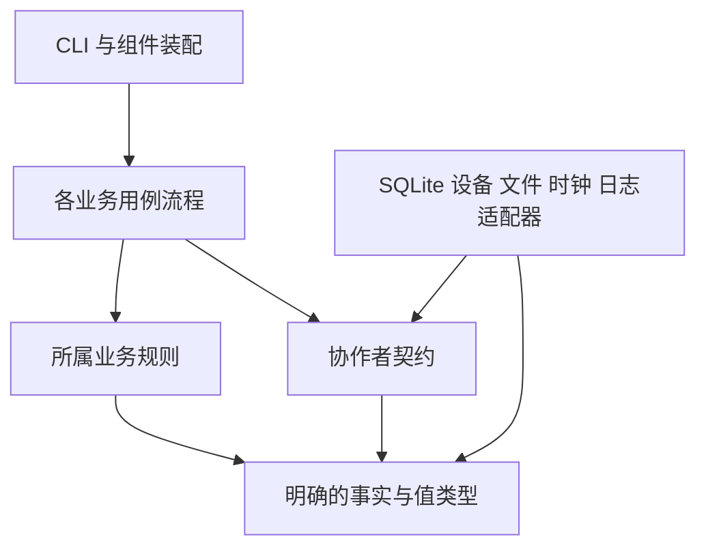
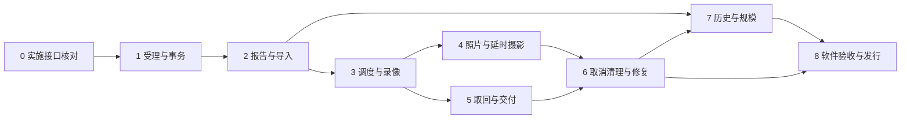

# camctl 第一版实施路线图

本路线图规划嵌入式主机上 camctl 的软件实施，以及它与现有客户端、C 接入模块的组合验证。目标是把受理、设备执行、产物处理、历史保存和报告交付逐段做成可运行的软件，同时使每个模块具有清楚的责任、输入输出和恢复边界。

**推荐路线：先确定模块接口与原子提交边界，再按完整业务链增量实施。** 第一条可运行链贯通初始化、受理、报告与客户端导入；随后接入采集、取回和交付，再完成取消、清理、录像处理及规模验证。每条链在引入副作用时同步实施失败与恢复，恢复依据从首次写入起就完整保存。

**规划性质：** 本文编排阶段、任务依赖及业务链门禁，具体实施由下列 15 个模块计划和 1 个跨组件集成计划承接。每个模块计划定义接口与数据、状态分区、具体修改位置、任务顺序、先失败测试、执行命令及完成门禁。既有行为契约与项目规则是硬性要求；内部类型、包名、接口、任务和提交拆分中未由规格固定的部分均为建议。实施前核对所需前置交付及实际代码，调整建议时同步消费者计划。

**设计依据：** [设计入口](../../camctl/README.md)、[实现总览](../../camctl/implementation.md)、[实施准备](../../camctl/implementation-readiness.md)、[事务契约](../../camctl/database/transactions.md)及各业务专题；公共表示以根 [protocol](../../../protocol/README.md) 为准。

**技术基础：** 沿用[既定技术选型](../../camctl/implementation.md#基础技术选型)。组件在 apps/camctl 管理 Python 包、依赖、构建与测试；生产和测试依赖在 Python 3.11 下分别锁定。具体版本由组件锁文件接管，路线图不维护另一份版本清单。

## 实施起点与范围

apps/camctl 的 Python 包、命令入口和业务模块按后文阶段推进。公共协议、数据库结构、整数登记、事件转换规则与报告字段依赖已有设计和检查工具；这些工具验证规格之间的对应关系，生产事务、业务校验、历史恢复和报告生成须通过各阶段的真实消费者门禁。

客户端和 C 接入模块已有代码。客户端还需完成[公共报告适配计划](2026-09-30-report-client-adaptation.md)及请求身份、时间和能力说明的相关接入。C 模块已有的受控 CLI 验证不能代替真实 camctl 接入验证。

软件集成使用真实 Python 包、SQLite、文件系统、线程、进程、客户端和 C 模块，设备响应由受驱动契约约束的替身提供。ARM64 环境安装、真实相机、目标主机性能及物理断电持久性另列部署联调，不作为软件集成测试的运行前提。

公共计划、动作、设备状态和报告模型保持设备无关。第一版 MCU 仅遵守[接口预留与不支持动作的受理规则](../../architecture/mcu-actions.md)，不增加实际通信工作或运行依赖。

## 贯穿全部阶段的契约

以下要求来自现有规格。具体状态、字段和决策分区仍由链接中的责任专题完整定义。

| 契约 | 实施时必须保持的结果 |
| --- | --- |
| [历史与事务](../../camctl/database/transactions.md) | 历史、当前投影、对象恢复关联、实际报告变化及维护进度共同提交。历史回放只恢复事实，不重新决策、分配身份或执行副作用。 |
| [受理与请求身份](../../architecture/plan-acceptance.md) | run 与 submit 共用受理规则。首次计划及全部动作原子保存；同请求复用首次成功受理的内容；计划正文与 ACK 独立判断并共同提交。 |
| [操作与设备证据](../../camctl/file-runtime.md#设备驱动接口契约) | 普通调用先可靠保存意图和次数，再派发。调用结束、命令发送、设备启动及文件完成分别表达，驱动不管理业务重试或动作终态。 |
| [取消与实际完成](../../camctl/implementation.md#接口结果与所有权) | 等待协程取消后，已开始的数据库、线程和设备工作继续被跟踪。责任拥有者保存结果，并完成适用通知和收场。 |
| [文件交接](../../architecture/file-handoff.md) | 文件移动、目录同步、数据库记录和主程序领取分别确认。普通交付、报告与日志副本采用各自恢复规则。 |
| [配置与历史](../../architecture/configuration.md#执行依据与历史报告) | 新操作使用本次运行配置；原身份、累计次数、已保存决定和终态保持。旧报告只使用冻结历史中的依据。 |
| [会话与报告](../../architecture/protocol-session.md) | needs_run 与退出使用同一责任分类。报告失败保留责任，可靠的普通设备执行继续；状态库失效按执行前提错误处理。 |
| [类型与精度](../../camctl/data-types.md) | 原始输入、ID、精确数字、时间、缺省与 null 的含义贯穿保存、回放和输出。有限分类从权威登记取得，未知值按所属契约处理。 |
| [分页结果](../../camctl/module-contracts.md#分页结果契约) | 读取方交付有界数据与继续位置，调用方按只读结束属性继续或结束；空有效页不表示读完，最后一批数据必须处理，错误不伪装成结束。 |
| [第一版边界](../../camctl/implementation.md#第一版实现范围) | 实施规定的有界处理、有限预算与恢复。后置的资源协调机制继续按运行证据评估；数据库历史永久保留。 |

## 模块划分与依赖建议

建议把经常共同变化的业务规则、流程和接口放在同一模块内。模块内部再区分规则计算与外部操作，数据库和设备实现通过明确接口接入。CLI 只组织命令入口和结果输出，跨业务协作由对应用例负责。

下表是责任划分建议，均位于 apps/camctl/src/camctl。文件可以按实际数据流调整；每项状态归属、完成含义与事务要求必须保留。

### 模块计划与任务入口

[共享实施契约](../../camctl/module-contracts.md)定义类型归属、依赖方向、原子提交及结果接手。模块计划按责任独立阅读，路线图按任务交付安排先后；“提供类型或端口”与“真实消费者组合通过”分别跟踪，不把整个消费者模块作为提供者的前置条件。

| 建议模块 | 集中负责什么 | 独立计划与任务 | 提供给消费者的交付 |
| --- | --- | --- | --- |
| contracts | 身份、精确 JSON、时间、历史边界、分页及纯公开投影。 | [共享类型计划 K1—K5](2026-09-30-camctl-contracts.md) | 受约束值类型、解析结果和单对象公开字段计算。 |
| cli 与 bootstrap | 命令解析、配置、资源、显式初始化及组件装配。 | [入口与装配计划 B1—B7](2026-09-30-camctl-bootstrap.md) | 命令入口、冻结配置、安装资源和实际协作者。 |
| acceptance | 分层校验、首次受理、请求复用、执行定义及独立 ACK。 | [受理计划 A1—A6](2026-09-30-camctl-acceptance.md) | 完整受理结果和可靠输入诊断；run/submit 共用入口。 |
| session | 锁、启动资格、工作交接、实际结果监督及会话收尾。 | [会话计划 S1—S6](2026-09-30-camctl-session.md) | 统一责任分类、接手接口、可靠接纳与退出结果。 |
| scheduling | 时间与顺序、工作发现、通知、按需执行及设备资格。 | [调度计划 Q1—Q6](2026-09-30-camctl-scheduling.md) | 唤醒依据、可推进责任和重新核对后的派发授予。 |
| operations | 尝试、意图、预算、真实调用结果和工具生命周期。 | [操作计划 O1—O6](2026-09-30-camctl-operations.md) | 可靠派发凭据、分类证据及实际调用结束；业务终态由所属流程决定。 |
| devices | 静态能力、绑定、单次设备操作、证据与读取会话。 | [设备计划 D1—D5](2026-09-30-camctl-devices.md) | 按实际能力划分的端口和证据；驱动不决定业务重试。 |
| host_files | 实际文件观察、线程任务、分段、同步、移动及媒体工具。 | [文件计划 F1—F7](2026-09-30-camctl-host-files.md) | 文件操作的真实阶段及结束结果；不保存动作终态。 |
| capture | 录像、照片、延时摄影的执行、核实、恢复及内部处理。 | [采集计划 C1—C9](2026-09-30-camctl-capture.md) | 固定执行定义、可靠采集依据、正式登记及独立设备收场。 |
| outputs | 登记、来源、资格、拷贝、交付、清理和中间文件生命周期。 | [产物计划 X1—X12](2026-09-30-camctl-outputs.md) | 原子文件资格、可复用拷贝、独立交付和清理结果。 |
| cancellation | 完整目标、自身检查、取消生效及发起者汇总。 | [取消计划 N1—N6](2026-09-30-camctl-cancellation.md) | 固定目标及可靠决定；实际收场由目标拥有者继续。 |
| reporting | 报告资格、冻结、编码、进程、发布、补投、ACK 与同步。 | [报告计划 R1—R9](2026-09-30-camctl-reporting.md) | 冻结报告、生成与发布事实、累计确认及未完成责任。 |
| history | 事件校验、目录、正逆恢复、同 H 查询和快照。 | [历史计划 H1—H7](2026-09-30-camctl-history.md) | 有界历史视图及完整成员；回放不执行副作用。 |
| persistence | 连接、执行队列、完整事务、结果核实及窄仓储实现。 | [持久化计划 P1—P6](2026-09-30-camctl-persistence.md) | 完整业务事务、关闭游标后的批次和可靠结果。 |
| logging_runtime | 日志接纳、水位、写入、轮换、关闭及故障副本。 | [日志计划 L1—L6](2026-09-30-camctl-logging.md) | 普通接纳和独立副本凭据；副本交付不依赖状态库。 |

[跨组件集成计划 I1—I6](2026-09-30-camctl-integration.md)另外负责 C 进程启动及原组收场、客户端身份与协议适配、完整用户链和全量验收映射。模块计划共有 103 项任务，跨组件计划共有 6 项任务；复选框均留待实际实施和验证后勾选。

共享类型按 K1—K4 提供明确消费者所需的稳定值；业务阶段、SQL 行和厂商响应留在各自责任范围。K5 检查真实依赖，避免共享模块承载业务流程。

较大的业务模块建议按独立用例继续拆分。capture 内分别组织录像、照片和延时摄影；outputs 内分别组织登记、来源选择、拷贝、清理和交接；reporting 内分别组织资格规则、内容生成、进程监督和维护流程。每个用例保留自己的规则、协作者契约和测试，公共接口只表达独立业务操作与稳定协作边界。

动作路由建议采用按动作类型登记的处理器目录。调度只使用公共资格、状态和资源事实，专属执行定义交给相应处理模块解释。驱动接口按控制、查询、读取和删除等实际能力分别定义，能力声明决定适用接口及完成路径。

下面表示依赖方向。实际适配器在装配时传入业务流程；流程依赖协作者契约。

依赖审查应检查实际导入关系和运行行为：规则不访问外部资源；流程不自行创建数据库连接或寻找全局设备；适配器不调用调度或报告维护流程。需要跨模块调用时，只经过已定义的公共接口。

事件保存和报告生成都会判断公开结果，建议复用一个不访问外部资源的公开投影模块。它输入明确历史边界处的事实，输出公共契约所需的字段；事件消费者用它比较变化，报告生成器用它输出内容。每次只处理一个对象或有界的字段依赖，实体子集合由分页读取和编码组织。共享投影由 K4 提供，H2 用它比较变化，R1/R3 用它生成字段；依赖保持单向，不能经由报告协调器回调数据库写入。

### 跨模块的原子提交

模块划分不改变业务事务。建议每个跨模块用例拥有一个明确的提交入口，各模块提供类型化输入与规则，由持久化执行方在写事务内取得可靠旧状态、完成校验并共同保存。

| 用例 | 原子提交的内容 | 事务外的后续工作 |
| --- | --- | --- |
| 受理输入 | 计划与全部动作或拒绝诊断、有效关联、独立 ACK 结果及适用同步结束。 | run 取得相应资格后推进工作；submit 返回接管判定。 |
| 开始设备尝试 | 当前资格、原流程与活动身份、尝试意图、次数和本次采用依据。 | 可靠提交后再次检查派发条件，执行本次明确调用。 |
| 采集结束 | 可靠完成事实、适用内部处理结果、正式产物及关联、动作终态和父计划变化。 | 通知来源依赖方，由各自事务固定选择及授予资格。 |
| 取得文件资格 | 候选顺序、读取保护或删除限制，以及该分支要求的交付、拷贝、文件和流程记录。 | 执行已获准的读取或删除；等待本身不消耗尝试次数。 |
| 副本准备完成 | 完整文件依据、交付准备状态、源读取依赖解除及相关历史。 | 通知清理重新判断；发布仍遵守整体取回条件。 |
| 取消与收场 | 完整固定目标、逐目标生效事实及必要独立责任。 | 目标继续实际收场，取消发起者按自己的范围汇总。 |
| 报告冻结与发布 | 冻结时保存完整 H 和覆盖依据；发布结果另按实际文件事实保存，并共同更新适用同步及动作结果。 | 生成与文件移动在事务外进行，生成期间的新变化归后续报告。 |

完整目录以[事务契约](../../camctl/database/transactions.md#写操作目录)为准。跨模块操作不能由几个自行提交的表更新函数拼成。

## 接口完成含义与所有权

接口设计首先回答“返回后已经确认了什么”。每个接口都要说明输入输出、数据所有权、执行位置、失败与未知、重复调用条件，以及保存和恢复由谁负责。

H 表示报告冻结的完整历史事务边界，C 表示一次读取当前投影时绑定的完整边界。每批投影与自己的 C 同时取得，历史恢复最终都表达同一 H 的状态；业务变化序号只用于选择应报告的对象，不能代替历史边界。

建议在稳定协作者边界使用 typing.Protocol（结构化接口约定），数据使用 dataclass 和受约束的枚举。Protocol 用于表达调用契约，类型标注不代替输入及状态校验，见 [Python 3.11 typing 文档](https://docs.python.org/3.11/library/typing.html#typing.Protocol)。跨线程传递的集合须具有独立所有权或不可变表示；frozen=True 只约束字段赋值，不能单独保证内部集合不可变，见 [dataclasses 文档](https://docs.python.org/3.11/library/dataclasses.html#frozen-instances)。

| 接口边界 | 建议的输入与输出形态 | 成功返回证明什么 | 责任归属 |
| --- | --- | --- | --- |
| accept_input | 完整解析结果或输入诊断、受理上下文；返回计划结果和独立 ACK 结果。 | 本次处理已经提交，业务结果可以是复用、新受理或可靠拒绝。 | acceptance 组织，持久化方在事务内再次核对请求身份。 |
| 各用例写操作 | 类型化业务命令、稳定 operation_key、目标和证据；返回完整提交结果。 | 相关事实及投影共同提交。 | 所属用例提供规则，持久化方控制完整事务并跟踪实际结果。 |
| read_batch | 数据库身份、H、固定范围、恢复依据、游标和批量上限；返回批次与继续位置。 | 本批查询成功且相关游标、读事务已经结束。 | 历史读取方管理固定范围；接收方在事务外恢复和编码。 |
| 设备调用 | 已保存的尝试身份、绑定、参数和期限；返回调用结果、证据及原始错误。 | 只证明驱动明确声明的发送、启动、结束或完成事实。 | 驱动解释证据，业务流程保存并决定继续、核实或结束。 |
| 文件分段与发布 | 原身份、文件归属、可靠进度及停止通知；返回实际阶段、处理范围与同步结果。 | 证明相应文件操作的实际效果，分段完成不证明进度已入库。 | 实际任务结束前持有文件修改权；所属流程推进数据库事实。 |
| 报告生成任务 | 数据库、报告、生成任务及临时文件身份和冻结依据；返回大小、摘要及分类结果。 | 文件生成和规定同步完成；最终发布尚由主进程负责。 | 子进程持有读取和写出资源，主进程验证结果、发布及保存。 |
| 日志与副本 | 普通记录；需要副本时在入队前绑定故障及文件凭据。 | 普通返回表示接纳；副本凭据另行证明触发记录写入与副本处理结果。 | 日志线程协调共享锁内追加及复制，独立流程完成交接。 |

### 数据库结果与等待者取消

数据库实际执行状态与业务结果分开表达。取消只改变等待关系及允许的后续工作，不把已经开始的操作变成未执行。

| 实际状态 | 结果接手与后续操作 |
| --- | --- |
| 尚未开始，已确认撤回且以后不会执行 | 返回未执行，释放等待条目；按所属业务资格决定是否还能安排工作。 |
| 派发与撤回竞争，尚未确认哪方成立 | 保留责任并确认实际阶段，不先输出未执行。 |
| 已开始，尚未取得结束结果 | 执行方继续跟踪；等待者取消时由会话监督下的责任拥有者接手。 |
| 提交成功 | 消费已提交业务结果，刷新适用状态及通知；已取消的原流程只执行允许的收场。 |
| 提交前失败，回滚成功 | 保留实际错误，不更新成功缓存，不产生依赖本次提交的副作用。 |
| 提交或回滚结果未知 | 停止依赖步骤，按原 operation_key、输入及目标核实。原结果可靠存在时复用；可靠不存在且原事务不可能迟到提交时，才按原资格考虑重做。 |

接口中的“不存在”“未知”“无效”“尚未完成”“有效空集合”要有分别可检验的表示。文件候选页在 H 没有有效成员，也可能仍有后续候选；继续位置按已检查候选推进，不凭结果为空结束。

## 阶段顺序与门禁

阶段之间按交付物依赖推进。阶段 4 与阶段 5 在阶段 3 的产物和驱动契约稳定后具备分别推进的条件；阶段 7 的查询与快照工作可在阶段 2 后开始，其完整验收要等阶段 6 的所有事件和文件生命周期接入。下图表示阶段门禁的依赖，提前开展的工作仍须在完整输入到位后通过门禁。

| 阶段 | 主要交付物 | 依赖 | 退出门禁 |
| --- | --- | --- | --- |
| 0 实施接口核对 | 审阅模块计划、协作契约、生命周期模型及首批任务依赖。 | 既有设计与实际仓库。 | 没有未定义的关键接口接缝；第一批工作可以机械执行。 |
| 1 受理与事务内核 | 可安装包、显式初始化、能力导出、统一受理及历史写入。 | 阶段 0。 | 并发受理、精确往返、事务和取消结果通过真实组合验证。 |
| 2 报告与客户端闭环 | 真实 run、报告进程与文件发布、导入、ACK、日志副本。 | 阶段 1及相应客户端适配。 | 无设备采集的完整业务链可运行，旧报告可确定性重建。 |
| 3 调度与录像 | 调度通知、设备协调、受管调用、录像、停止、核实及错误收场。 | 阶段 2。 | 设备替身下的录像完成并登记产物；中断恢复与预算不变量成立。 |
| 4 照片与延时摄影 | 按各能力声明执行和恢复，多产物及预览关系。 | 阶段 3。 | 不同返回与完成方式均按各自契约处理。 |
| 5 取回与交付 | 固定来源、逐项资格、分段拷贝、独立交付与发布恢复。 | 阶段 3。 | 产物真实进入 processing，续传和交接未知均得到规定结果。 |
| 6 取消清理与录像处理 | 完整取消、显式源清理、异常检查修复、自动预览及中间文件清理。 | 阶段 4、5。 | 竞争与独立收场闭合，已有终态和原请求结果保持。 |
| 7 历史与规模验证 | 完整快照、历史文件查询、分页路径、缓存及资源测量。 | 阶段 2可启动，阶段 6后完成。 | 三种历史恢复一致，批次与缓存不改变报告字节，实际查询成本受检验。 |
| 8 软件验收与发行准备 | 第一版完整跨组件场景、独立安装的发行物和部署检查说明。 | 阶段 6、7及全部相关消费者适配。 | 全部软件契约有实现与证据归属；目标机待核验事项独立列明。 |

### 阶段 0 实施接口核对与首批任务

**计划入口：** [模块协作契约](../../camctl/module-contracts.md)及[上方模块计划目录](#模块计划与任务入口)。本阶段审阅已经给出的实施建议，不以再次编写一份同范围计划作为交付。

- [x] 按各模块“接口与数据”核对类型、状态归属及完成含义，明确共享值、业务命令、设备观察和 SQLite 行的边界。所有有限结果分类由拥有者集中维护。
- [x] 沿原子提交目录走查受理、意图、采集登记、文件资格及进度、取消、报告冻结与发布，确定每个完整用例的仓储入口、事务内校验、结果接手和事务外副作用。
- [x] 检查任务引用所需的是类型、纯规则还是实际生产能力；先提供基础交付，再收齐消费者组合证据。C9、X12、N6、R9 等最终验收不互设前置。
- [x] 审阅 R4/R5 的消息及进程模型、F2/F3 的缓冲和实际结束、L2/L3/L6 的取消关闭、I1/I2 的组身份及回收。未由正式规格固定的容量和时限是建议初值，消费前集中记录合法范围与配置来源。
- [x] 核对 B1 权威资源打包、K5 实际依赖检查及 I6 验收映射。明确计划中的尚未核验前提，真实设备命令和目标部署资料单独取得。
- [x] 选择阶段 1 中已具备前置交付的任务开始实施；遇到行为语义缺失时只停止受影响任务，说明事实和需要决定的具体问题。

**门禁：** 首批任务的类型、事务、接手、失败和验证入口清楚；基础接口可以独立实现，没有必须相互等待的生产依赖。工程建议的调整同步消费者计划，正式行为不因内部组织改变。

### 阶段 1 受理与事务内核

**任务入口：** [B1—B5 包与入口](2026-09-30-camctl-bootstrap.md#b1-可安装包与资源来源)、[K1—K4 公共值与投影](2026-09-30-camctl-contracts.md#k1-身份时间和整数枚举)、[P1—P4 事务内核](2026-09-30-camctl-persistence.md#p1-既有库打开与运行条件核验)、[H1—H3 事件与回放](2026-09-30-camctl-history.md#h1-事件版本与具名校验消费者)、[A1—A5 受理](2026-09-30-camctl-acceptance.md#a1-一次完整读取及解析)。

**协作前置：** [S1/S2/S4/S5](2026-09-30-camctl-session.md#s1-统一待处理责任分类)、[Q3 通知](2026-09-30-camctl-scheduling.md#q3-提交与进入等待的通知交接)、[D1/D2 静态能力与证据](2026-09-30-camctl-devices.md#d1-同源静态能力与参数规则)、[F1 文件输入](2026-09-30-camctl-host-files.md#f1-文件定位与分类观察)、[R1/R2/R6 报告及 ACK 纯规则](2026-09-30-camctl-reporting.md#r1-公开字段与报告身份模型)、[L1—L4/L6 日志基础](2026-09-30-camctl-logging.md#l1-纯水位采样和丢弃计数)。C1/X2 的执行定义类型先提供给 A3；P5 先接入本阶段所用仓储，后续业务仓储随所属任务增加。

**工作包 1.1：包、资源与显式初始化。** 在本阶段一并建立 pyproject.toml、uv.lock、src 布局及分类测试。打包公共 Schema、所需规格 SQL和内部登记，保证安装后不依赖源码仓库。实现 init、describe、本地配置和状态库入口检查；describe 保持无状态库依赖。初始化遵守不覆盖、完整可用、目录绑定及同步要求。

**工作包 1.2：事件与数据库执行。** 实现专用线程、完整事务、WAL 与 FULL 同步配置、容量和入队时限、取消与连接失效分类。事件消费者读取统一登记，执行适用业务校验和整笔事务检查；将事件、前后值、两类目录、投影及维护进度共同保存。对本阶段事件实现正向回放及结果核实，业务操作通过各自窄接口接入。后续事件随工作包增加消费者；缺少适用校验实现时明确拒绝写入。

**工作包 1.3：统一受理。** 实现无歧义解析、精确数字与时间、驱动静态校验、原始输入保存、动作执行定义、首次受理与重送及独立 ACK。submit 使用完整事务和接纳探测；run 在阶段 2 复用同一入口。已受理请求的本次正文不参与重新校验。输入规则错误、用户参数错误和状态库错误保持区别。

**工作包 1.4：日志基础。** 接入既定队列与文件处理器，完成来源路由、原子水位、采样、通道禁用和有序关闭。库内部扩展点集中适配并绑定经过验证的版本；重要日志等待不能阻止必要业务收场。

- [x] 从最窄的失败用例开始验证精确值、请求复用、单动作失败、整份拒绝、ACK 组合及父计划状态。未支持的 MCU 动作按整份拒绝处理，不产生部分受理或设备操作。
- [x] 组合真实 SQLite、执行线程和受理服务，验证并发同请求、回滚、提交未知、取消与派发竞争，以及取消后结果接手。
- [x] 比较正常写入与初始回放的投影、计数和历史引用；注入校验及提交错误，确认没有部分受理或依赖失败保存的副作用。
- [x] 在独立进程中验证安装资源、缺失或无效库拒绝、初始化竞争、目录绑定及 describe；组合真实日志队列和独立写入进程验证日志生命周期。

**门禁：** init、describe、submit 可通过组件接口运行；数据库失败不被包装成业务拒绝，提交未知可按原身份核实。阶段 1 的软件入口与资源均有真实组合验证。

### 阶段 2 报告与客户端首条闭环

**任务入口：** [B6 装配](2026-09-30-camctl-bootstrap.md#b6-按命令装配与资源关闭)、[A6 双入口](2026-09-30-camctl-acceptance.md#a6-两个入口及原输入恢复组合)、[S3/S6 会话](2026-09-30-camctl-session.md#s3-受理后时钟资格与受限执行)、[Q1—Q3/Q5 无设备调度](2026-09-30-camctl-scheduling.md#q1-时间资格与统一排序)、[H4/H5 历史读取](2026-09-30-camctl-history.md#h4-短读事务与固定-h-分批查询)、[R3—R8 编码、进程与发布](2026-09-30-camctl-reporting.md#r3-确定性流式编码)。

**组合任务：** [F2/F4/F5 文件执行与交接](2026-09-30-camctl-host-files.md#f2-默认线程池任务与唯一修改权)、[L5 独立日志副本](2026-09-30-camctl-logging.md#l5-独立故障标记与锁内副本)、[I1—I4 C/客户端与首条闭环](2026-09-30-camctl-integration.md#i1-独立进程组明确启动结果与主程序约定)。H5、S5、Q5 先通过本链的实际协作门禁，其他消费者证据在接入后补齐。

**工作包 2.1：历史读取与报告内容。** 实现固定 H 的对象选择、短读事务、绑定 C 的投影及逆向恢复、父对象补齐和分批确定性编码。新增变化与内部变化分别处理；每个新业务事件接入时都验证公开投影和目录。无快照时使用既定可靠路径，快照资格和计数已经由阶段 1 保存。

**工作包 2.2：报告进程与维护。** 实现 spawn、独立工作锁、父进程死亡保护、专用通信线程、任务身份、结果与退出竞争、分阶段时限及实际回收。主进程登记冻结依据、最终发布和保存结果；普通报告失败保留责任，状态库及历史错误采用原错误规则。

**工作包 2.3：run、文件交接与日志副本。** 用输入诊断或只含 report_status 的计划验证正常启动、时钟资格、会话接纳及关闭、报告发布、同步和 ACK。文件接口从本阶段起保留移动与同步的实际阶段。日志副本实现独立故障标记、触发错误与复制的锁内协调、一次交付及失败清理。

**工作包 2.4：消费者接入。** 按现有客户端适配计划完成本链所需的 ID、报告导入、可靠保存和 ACK 处理。I3 具体落实整数请求 ID 分配建议、可靠保存、精确时间和真实能力消费。先核对既有 C 模块与[启动及回收契约](../../host-demo/design.md#受管工具的启动与主程序回收约定)，将独立进程组、退出观察、原组收场及最终回收所需的修改列为本链前置任务；再用真实模块启动 CLI、领取文件并完成客户端导入。基础接缝未接入时不把样例检查视为门禁通过。

- [ ] 先验证输入拒绝但 ACK 有效、只吸收 ACK、报告冻结后新提交、同报告重建以及报告失败保留责任。
- [ ] 用真实进程和管道交错结果、退出、超时与停止；验证迟到结果、缺失结果、文件实际所有权和通信线程回收。
- [ ] 将报告从 staging 发布到 ready，由 C 模块领取到 processing，客户端核验并保存后输出 ACK，再由统一受理接口吸收。
- [ ] 改变读取批次及后续配置，验证同一报告重建的原始字节与摘要；破坏必要历史或状态库，验证错误分类和未完成责任。
- [ ] 在状态库不可用时验证日志副本流程；强制另一进程竞争轮换，确认副本包含触发错误且没有递归复制。

**门禁：** 第一条无设备采集的软件链真实可运行，受理、报告、领取、导入、确认均有可观察证据。报告进程及日志资源已实现规定的失败收场。

### 阶段 3 调度、受管调用与录像

**任务入口：** [Q2/Q4/Q5 及 Q6 录像释放分区](2026-09-30-camctl-scheduling.md#q4-原子授予启动保留与派发再检查)、[O1—O6 尝试及工具](2026-09-30-camctl-operations.md#o1-完整结束结果及证据校验)、[D3/D4 操作及读取](2026-09-30-camctl-devices.md#d3-一次设备操作及原始返回适配)、[C1—C3/C6/C7 录像、核实及应急](2026-09-30-camctl-capture.md#c1-专属定义及能力路由)、[X1 正式产物](2026-09-30-camctl-outputs.md#x1-正式产物登记及文件关系)。

**组合任务：** 随本阶段生产能力完成 [I5 的录像场景](2026-09-30-camctl-integration.md#i5-三种采集取回取消及清理的跨组件组合)，复验 I1/I2。N1—N3 的目标契约、取消资格和目标接手先支撑录像；Q6 的文件释放与取消完整用户范围在阶段 5、6 收齐。

**工作包 3.1：调度与设备协调。** 实现纯规则决策、按需创建执行协程、准备及窗口、分页工作发现、可靠占用与启动保留。变化通知、检查与进入等待的交接使用明确同步点验证；首次授予、意图及次数共同提交。缓存只服务读取，派发资格在规定边界再次核对。

**工作包 3.2：调用与证据。** 实现 operations 的公共契约，接入受管工具的异步执行、有限期限、本地终止与实际退出确认，以及设备操作的证据类型和版本。操作结果、设备活动和动作终态作为不同事实表达，按所属业务要求共同提交。软件测试用受控本地进程及驱动替身，不猜测厂商命令与响应。

普通 ADB 客户端、媒体工具及包装程序保持所属 camctl 进程组，保留主程序检查和终止权限；共享 ADB 服务端按[独立生命周期](../../architecture/adb-execution.md#共享-adb-服务端的生命周期)处理。按[进程收场实施准备](../../camctl/implementation-readiness.md#驱动与主机的实施准备)细化保留退出记录、分批成员及存活线程检查、原组终止和最终回收；成员退出、读取被拒绝、信息不完整和解析失败分别处理。新增工具入口都需审计这些条件。

**工作包 3.3：录像及有限恢复。** 实现启动、计时、停止、查询、文件关联和完成登记。窗口结束与在途调用按现有分类处理；已有尝试及活动沿原身份恢复。首个设备副作用接入时，同时实施绑定错误、时钟异常、数据库失效、必要停止与应急最终补记。

- [ ] 先验证窗口观察、窗口外未派发、窗口内发出但窗口后确认、原尝试未知、准备及重复唤醒、候选在后续页和缓存淘汰。
- [ ] 验证同设备占用、不同设备推进、有限预算、查询用途、配置变化及调用结束晚于流程结束；取消不会提前释放实际占用。
- [ ] 在意图提交、派发、设备响应、结果保存和产物登记前后中断，验证不会重复录像、补满预算或改写既有终态。
- [ ] 组合真实调度、SQLite、报告与驱动替身，完成录像及产物登记；受控工具模拟进程组、终止和调用收场，C 模块验证后续调用放行。

**门禁：** 录像主流程及其必要失败恢复成立，可靠产物与动作终态同事务保存。终态后仍存在的实际调用和设备责任可以继续发现并收场。

### 阶段 4 照片与延时摄影

**任务入口：** [C4/C5 照片与延时摄影](2026-09-30-camctl-capture.md#c4-单张拍摄独立流程)、[C6 结果核实](2026-09-30-camctl-capture.md#c6-文件归属集合核实及占用释放)、[D5 软件驱动契约](2026-09-30-camctl-devices.md#d5-驱动契约测试与实际设备接入交付)及 [I5 的相应组合](2026-09-30-camctl-integration.md#i5-三种采集取回取消及清理的跨组件组合)。N2/N3 随各能力补齐停止资格及有限收场；D5 的真实设备映射仍属独立联调。

**工作包 4.1：单张拍摄。** 接入相应执行定义、有限尝试、产物归属、取消和多文件登记，不强加录像式计时或停止。

**工作包 4.2：延时摄影。** 根据驱动声明分别实现发送后等待、原生调用完成后返回、主机负责结束等适用路径。状态查询为可选能力；无查询路径保存发送成功锚点、等待依据及重启剩余等待。结果核实每轮计数，轮内分页不隐式增加尝试。

**工作包 4.3：设备文件与预览关系。** 归属、单文件写完、集合齐备和必需检查分别保存；文件与产物保持稳定关联。预览配对消费明确证据，不按目录顺序选择。

- [ ] 逐个返回及完成分区建立失败用例，验证发送成功不会变成设备直接观察，可靠事实与调用错误能够共同保留。
- [ ] 覆盖单文件、多文件、合法空结果、集合未齐、明确不满足、读取错误、核实耗尽及跨运行配置变化。
- [ ] 覆盖未启动取消、已启动无停止能力的取消拒绝，以及照片和延时摄影中断后已完成文件的保留。
- [ ] 组合真实持久化、调度和报告，验证每种能力的正常、取消及恢复结果；旧报告仍使用原依据。

**门禁：** 三种相机动作均采用自身契约，设备声明可以替换而公共调度、产物和报告模型保持稳定。

### 阶段 5 取回、可恢复拷贝与普通交付

**任务入口：** [X2—X7 来源、资格、拷贝与交付](2026-09-30-camctl-outputs.md#x2-来源固定选择与精确-id)、[F3/F4 分段及可靠文件操作](2026-09-30-camctl-host-files.md#f3-段内小块传输与源无数据观察)、[X11 中间文件基础](2026-09-30-camctl-outputs.md#x11-中间文件生命周期与有限维护)、[D4 读取控制](2026-09-30-camctl-devices.md#d4-源读取会话与独立停止控制)及 [I5 的取回组合](2026-09-30-camctl-integration.md#i5-三种采集取回取消及清理的跨组件组合)。拷贝及交接取消分支先接入目标责任，用户跨范围汇总留给 N1—N6。

**工作包 5.1：来源与资格。** 实现本计划和跨计划来源、固定来源及逐来源选择、精确 ID 和逐项失败。来源完成后按计划时间及同时间取回优先决定资格。交付、拷贝、目标文件和读取流程共同建档；准备完成共同解除源依赖。

**工作包 5.2：分段拷贝。** 接入设备读取会话和默认线程池，逐段保存可靠进度，源数据与本地字节在传输执行方流动。实现长度、源身份、摘要、重拷轮次、无数据超时、重启续传与停止。实际读取结束前保留归属，必要设备控制继续能够推进。

**工作包 5.3：普通交付。** 先保存发布意图，再移动、同步并保存实际结果。主程序可在记录前领取文件；恢复按实际证据处理。三个位置均无副本且完成无法确认时，保存规定的交接未知失败，不自动重投。

- [ ] 先覆盖解析未完成、固定空来源、选择未完成、合法空选择、逐项错误及取消分区，不能把数据库错误当作空集合。
- [ ] 覆盖段内、同步前后及进度提交期间的取消和失败，验证可靠进度只在同步及数据库提交成功后推进。
- [ ] 在发布各边界中断，交错主程序立即领取和删除，验证已确认事实保留，未知普通交付不套用报告补投。
- [ ] 用真实 SQLite、文件和 C 领取模块完成录像后取回；验证重复取回取得独立交付，源文件与副本生命周期分开。

**门禁：** 采集、取回、独立交付、报告导入贯通，文件所有权和恢复结果符合全部适用决策分区。拷贝接口能够供内部录像处理复用。

### 阶段 6 取消、清理与录像内部处理

**任务入口：** [N1—N6 完整取消](2026-09-30-camctl-cancellation.md#n1-完整目标解析及自身检查)、[X8—X12 清理、预览、生命周期及组合](2026-09-30-camctl-outputs.md#x8-完整源清理与独立预算)、[C8/C9 内部处理及采集验收](2026-09-30-camctl-capture.md#c8-异常原片检查及内部修复)、[F6/F7 媒体及文件消费者](2026-09-30-camctl-host-files.md#f6-媒体工具的受管执行)和 [I5 的完整业务组合](2026-09-30-camctl-integration.md#i5-三种采集取回取消及清理的跨组件组合)。C9、X12、N6 使用已完成生产能力，分别验证而不相互等待。

本阶段建议按以下顺序组合，每个工作包保留独立测试和审阅门禁。前序阶段已经具备本地取消及实际结果跟踪，本阶段完成用户目标选择、跨类型汇总和竞争。

**工作包 6.1：完整取消。** 实现动作、组、计划和请求范围，先检查完整目标集合是否包含取消动作自身，再保存任何取消效果。完成取消动作自身被取消、自动预览扩展、设备停止、文件停止及交付撤回；已生效责任由目标独立继续。

**工作包 6.2：源产物清理。** 实现完整固定目标、读取保护、逐产物限制、唯一删除处理者、独立删除及查询预算、效果未知的核实与后续请求接手。清理项、文件事实、产物可用性、汇总错误及历史共同保存。正常运行和重启采用相同候选顺序。

**工作包 6.3：异常录像检查与修复。** 复用阶段 5 的读取资格与拷贝流程，接入 ffprobe、ffmpeg 的受管生命周期，以及原片检查、处理决定、临时文件、成品提升和正式登记。保留可靠采集事实，按适用处理与登记条件确定动作终态；终态成立时与正式产物及适用文件提升共同提交。

**工作包 6.4：自动预览与中间文件维护。** 按明确关联执行选择和交付，接入取消联动；取回完整副本和半成品、内部检查与修复文件按各自用途、操作状态及归属清理。删除失败保留后续有限责任，不重开原动作或原地循环重试。

- [ ] 逐项覆盖取消生效顺序、自身目标、取消发起者再被取消、迟到调用结果、已有终态和无停止能力任务。
- [ ] 交换来源结束、候选唤醒、选择提交、资格授予及删除顺序，验证排序与读取保护；覆盖先取回后清理、先清理后取回及同时间。
- [ ] 覆盖删除成功、失败、未知、查询确认不存在、取消后未知，以及另一个请求后来成功；各请求原结果及预算保持。
- [ ] 在内部输入准备、工具结束、成品登记、提升及文件清理前后中断，验证正式源文件、可恢复文件及无用副本各得其规定结果。
- [ ] 冻结各竞争边界的报告，组合真实数据库、文件、调度和报告验证当前状态及历史结果；报告不增加无需求依据的内部过程字段。

**门禁：** 所有用户动作的跨模块责任闭合；独立设备和文件收场不依赖发起者继续等待，清理和后续成功不改写旧请求或旧报告。

### 阶段 7 历史、快照与规模验证

**任务入口：** [H5—H7 文件历史、快照及全部事件](2026-09-30-camctl-history.md#h5-独立文件历史与关联候选)、[P6 缓存及真实成本](2026-09-30-camctl-persistence.md#p6-缓存与实际读取成本)、[K5 实际依赖检查](2026-09-30-camctl-contracts.md#k5-实际模块依赖验证)、[R9 全部报告消费者](2026-09-30-camctl-reporting.md#r9-完整报告与消费者验收)。H6 可在阶段 2 后先实施，H7/R9 在全部事件及生命周期接入后收齐门禁。

**工作包 7.1：完整对象历史。** 从统一历史对象登记取得快照资格，按逐表归属生成完整自身成员。实现独立文件历史、按 H 查关联文件，以及三种恢复路径的独立对照。采用事件发生时的关系核验和重建目录。

**工作包 7.2：快照维护。** 接入跨会话计数、索引候选、提交与对象发现通知、业务优先队列和分批保存。准备期间的新变化仍留在维护进度中；维护不单独延长会话，入队超时按本会话停用规则处理。

**工作包 7.3：分页、缓存与处理规模。** 落实有界预查询和大范围按对象 ID 续读，文件候选的空有效页继续。缓存绑定数据库身份、H 或 C 及完整依赖，不仅凭父对象自身计数复用结果。检查大实体、长历史、稀疏变化、跨页父子补齐及查询计划。

- [ ] 对每类已实现事件，从初始状态回放、快照正向恢复和当前投影逆向恢复到相同完整边界，比较成员完整性、精确值和引用。
- [ ] 改变页面大小、缓存命中、恢复方向和读取期间提交，验证同一报告的对象集合、顺序及字节不变。
- [ ] 在有代表性数据并更新统计信息的 SQLite 中核对首批和续读的实际索引、查询工作量与候选峰值，不能以空表计划或 LIMIT 推定性能。
- [ ] 测量主进程、报告进程及受管工具的合计资源，观察并发提交、报告及传输替身下的实际延迟、队列等待和文件任务积压，标明开发环境与负载。

**门禁：** 全部事件与历史对象接入，独立预期能够发现漏成员及错归属。资源通过数据结构与处理流程控制；测量结果不被改写为目标主机承诺。

### 阶段 8 跨组件验收与发行准备

**任务入口：** [I5/I6 全链及验收映射](2026-09-30-camctl-integration.md#i5-三种采集取回取消及清理的跨组件组合)、[B7 独立发行物](2026-09-30-camctl-bootstrap.md#b7-发行物与部署检查)，以及各模块尚未收齐的消费者门禁。I6 先汇总软件证据，B7 再验证安装后的相同能力。

- [ ] 完成真实客户端导出、C 模块递交、camctl 执行、文件领取、客户端导入和后续 ACK。覆盖录像、照片、延时摄影、普通和自动取回、取消、清理、同步及报告失败恢复。
- [ ] 组合多请求、跨计划引用、未来动作、并发 submit、结束阶段的新提交、时钟异常、绑定错误和终态后的独立责任；设备侧继续使用受契约约束的替身。
- [ ] 审计模块依赖、所有直接外部调用入口，以及异常、默认值、跳过和清理分支；每个分支具有明确事实和责任依据。
- [ ] 在源码仓库之外安装正式发行物，验证命令、包资源、配置、格式检查及日志；保留生产与测试依赖边界，提供目标 Python、SQLite 与外部工具的部署检查说明。
- [ ] 按验收映射逐项核对实际实现及验证证据，更新组件运行与验证文档，并独立列出目标机和设备待核验项。

**门禁：** 第一版软件闭环与全部适用失败恢复有可复查的证据。构建和安装验证属于集成测试；软件完成与实际部署通过分别报告。

## 验收覆盖与横切审查

阶段门禁逐步增加已有能力的验证范围。下表说明正式验收的主要阶段；模块计划已给出具体用例和入口，I6 在实施时把每条正式验收映射到实际测试及证据，避免只验证几个代表案例。

| 正式契约及验收入口 | 主要落实阶段 |
| --- | --- |
| [CLI](../../architecture/cli-commands.md)、[会话接管](../../architecture/protocol-session.md)、[受理](../../architecture/plan-acceptance.md)、[精确适配](../../camctl/data-types.md) | 阶段 1、2建立基础；阶段 3、6、8验证新增责任对接管及退出的影响。 |
| [调度验收](../../architecture/scheduling-execution.md#验收要求)、[录像验收](../../architecture/camera-verification.md)、[照片与延时摄影](../../architecture/camera-capture.md) | 阶段 3、4；其文件和取消组合在阶段 5、6、8继续验证。 |
| [产物与文件验收](../../architecture/output-verification.md)、[文件执行](../../camctl/file-runtime.md)及[取消](../../architecture/task-cancellation.md) | 阶段 5、6；阶段 7验证相关历史，阶段 8验证完整用户链。 |
| [报告与 ACK](../../architecture/status-reports.md)、[状态同步](../../architecture/status-sync.md)、[报告进程](../../camctl/report-runtime.md)及[日志执行](../../camctl/logging-runtime.md) | 阶段 1、2建立机制；每次接入事件验证目录与字段；阶段 7、8完成全部负载及组合。 |
| [数据库验收 01—51、69—72](../../camctl/database/consistency-verification.md)、W-01—W-20 | 阶段 3负责启动、占用与通知；阶段 5负责来源及读取；阶段 6负责清理、汇总与取消；阶段 7比较全部历史结果。 |
| [数据库验收 R-01—R-14、Q-01—Q-12、S-01—S-07、O-01—O-06](../../camctl/database/consistency-verification.md) | 阶段 2落实 C 启动及回收前提，阶段 3建立调用、查询、应急及占用；阶段 4、5、6审计每个新增操作入口，阶段 8验证完整组合。 |
| [数据库验收 V-01—V-04、E-01—E-02、J-01—J-06、F-01—F-08](../../camctl/database/consistency-verification.md) | 阶段 1建立运行库、整数与历史引用检查；阶段 2接入报告子进程；文件责任及路径在阶段 5、6接入；阶段 7、8覆盖完整状态。 |
| [数据库验收 52—68、H-01—H-06、P-01—P-06](../../camctl/database/consistency-verification.md#独立历史与报告重建)、[快照验收](../../camctl/history-snapshots.md#待细化事项与验收) | 阶段 2开始固定边界与分批读取；阶段 7完成全部对象、关系、恢复方向及具体分页，阶段 8组合真实消费者。 |

每个用例在交接和审阅时，都沿“权威输入 → 派生判断 → 原子事实 → 外部效果 → 结果保存 → 通知 → 失败恢复 → 用户可观察结果”完整走查。

| 横切场景 | 必须证明的协作结果 |
| --- | --- |
| 本次读取、查询或保存失败 | 错误保留实际步骤和已完成动作，不冒充不存在、空集合、业务参数错误或成功。 |
| 意图、外部效果与结果保存之间中断 | 原身份和预算保留，恢复按可靠证据分类；不会因重试创建第二次副作用。 |
| 提交后通知前退出 | 下一次 run 可以从持久化责任发现工作；普通运行中通知与等待交接不会遗漏。 |
| 取消发生在排队、执行或结果保存期间 | 实际操作只取得一个结果，目标责任继续，资源在真实结束后释放。 |
| 新配置、ACK 或新提交与旧工作交错 | 新操作使用当次依据，当前事务不覆盖其他事实，旧历史和报告保持。 |
| 源、产物与交付分别变化 | 归属与集合采用同 H，准备好的副本有独立生命周期，公开结果变化有相应目录。 |
| 报告失败或进程迟到结果 | 报告责任不丢失，错误分类不合并，可靠普通设备控制继续，临时文件不提前复用。 |
| 只剩维护、等待 ACK 或有限清理残留 | needs_run 与退出遵守同一分类，不重开已结束尝试或无限延长会话。 |

## 工作包执行与评审方式

每次向执行者交接具体模块计划、任务编号和所需前置交付。模块计划已经包含设计依据、输入输出、不变量、状态分区、事务与副作用顺序、失败恢复、预计位置及可证伪用例；实际实现不同于建议时同步接口及消费者，不省略相关门禁。

建议采用以下统一执行顺序：

1. 阅读责任专题，将涉及多个条件的行为写成完整决策表或状态模型，标出共享该不变量的入口。
2. 用最窄单元测试证伪契约，确认失败来自目标行为；跨真实边界的契约从集成测试开始。
3. 实现本工作包，运行针对性验证，再组合实际协作者验证失败和恢复；重要替身也遵守相同接口契约。
4. 审阅实际改动、依赖和验证证据，审计同类状态及入口，确认事务和责任交接闭合。
5. 更新阶段进度与文档，按可独立审阅的交付物提交。只有接口及本阶段门禁稳定后，后续工作才依赖它。

单元测试放在 apps/camctl/tests/unit，组件集成测试放在 apps/camctl/tests/integration，跨组件集成测试放在根 tests/integration。B1 建立 test 依赖组，命令采用模块计划与[共享契约](../../camctl/module-contracts.md#实施范围与统一执行方式)的统一入口；单元层不访问真实文件、数据库、网络或子进程，不把包构建和安装归为单元测试。

测试预期从输入事实和行为契约独立推导。正常写入与多个恢复方向的结果相等，可以验证路径一致性；还须用独立预期核对成员、引用与结果，避免多个路径共享同一错误。

规格的现有检查入口继续使用[脚本说明](../../../scripts/README.md)。它们是设计检查，生产验证必须额外证明业务校验、实际事务、恢复和可观察结果。架构依赖检查使用解析后的导入关系及运行行为，不用源码文本是否包含某个名称作为证据。

如果执行中出现未定义状态、代码或设备事实与计划冲突，或者必须改变既定协议，停止受影响任务并报告具体证据。其余独立工作仍可推进；新语义明确并更新计划后，再继续对应实现。

## 实施设计事项与部署联调

下列事项有已确定的行为边界，具体实现尚需落实。它们按所属工作包解决，不能被当成执行者可以忽略的细节。

| 事项 | 落实阶段与交付物 |
| --- | --- |
| 实际类型、签名与公共投影归属 | 共享契约及各模块计划已给出建议；阶段 0核对生产前置，K4/H2/R1 共用公开投影。 |
| 报告消息、任务身份、通信唤醒、退出与线程回收 | R4/R5 的规格规定身份、结果与回收边界；控制消息、通信线程及真实工作进程尚需实现，阶段 2验证身份、失效、迟到、退出和回收。 |
| 尚未指定的时限、缓存、缓冲和诊断容量 | 在消费方实现前提出可配置的初始值及合法范围，写入责任专题；软件测试覆盖边界，目标机随后校准。 |
| 设备和文件结果证据格式 | 阶段 3起按具体操作定义类型、版本、必要事实与保证范围，同源用于程序、替身及验证；厂商映射单独联调。 |
| 客户端整数请求身份和协议接入 | I3 给出分配与可靠保存建议，引用已有报告适配任务；阶段 2完成基础，阶段 8收齐业务消费者。 |
| C 模块的真实 CLI 启动与收场 | I1/I2 给出独立组、保留退出、有限扫描、线程状态及最终回收；阶段 2实施，O6 在阶段 3加入真实受管工具组合。 |
| 发行资源与依赖 | 阶段 1确定权威来源和生成方法，阶段 8验证独立发行物；Python 实际链接的 SQLite 始终按统一条件检查。 |

部署联调单独分为三个可核验交付：ARM64 目标环境安装与运行库、工具组合验证；真实设备参数、操作响应与归属证据映射；目标存储上的吞吐、合计资源及物理断电验证。软件替身通过不代表设备通过，开发环境资源测量不代表目标硬件性能。

具体设备命令与响应、目标部署依赖兼容性，以及现场负载与性能门槛仍待外部环境核验。依照[设备证据清单](../../camctl/integration-readiness.md#设备证据与联调输入)取得证据；实际能力不满足既定契约时，带具体事实讨论相应产品行为和保证范围。

## 启动顺序与进度判断

建议先完成阶段 0的接口及依赖核对，从 B1/K1 开始建立包与基础值，再按 P1、S2、H1—H3、P2—P4 及受理前置推进。第一批代码交付做到“可以安装、显式建库、导出能力、原子受理、核实结果和回放历史”，随后立即推进报告与客户端首条闭环。

进度以通过门禁的业务链和契约覆盖计量。每个工作包记录计划依赖、实际验证、待核验前提和后续影响；尚未完成的生产实现、软件集成及目标部署分别跟踪。

在阶段 1、2取得接口稳定性、测试和真实组合的数据后，再估算后续工作包的工期。路线图给出依赖与交付顺序，不承诺固定周数。

## 分模块审查进度

下列记录跟踪已有实施的质量审查，不能代替上文的完整阶段门禁。具体状态、修复矩阵和验证证据由各审查计划保存。

- [x] [基础契约](2026-10-01-camctl-contracts-corrections.md)：精确值、Schema、枚举、分页与历史读取边界。
- [x] [计划受理](2026-10-01-camctl-acceptance-boundaries-review.md)：请求身份、独立 ACK、原输入、生效参数、固定定义及来源关联。
- [x] [会话接管](2026-10-02-camctl-session-handoff-review.md)：输入保存与接管响应的事务边界、关闭规则和工作事实类型。
- [x] [累计确认与同步结束](2026-10-02-camctl-ack-sync-review.md)：报告与开始历史的资格、所有输入分区中的责任结束、原子失败及历史回放。
- [x] [报告范围与事务内选择](2026-10-02-camctl-report-freeze-review.md)：同一历史边界的 ACK 与全部同步、完整业务起点、生成/复用/跳过及旧报告固定依据。
- [x] [报告字节与发布事实](2026-10-02-camctl-report-publication-review.md)：固定字节、独立意图与成功、实际错误、原操作键复用及最近成功历史的数据库边界。
- [x] [报告编码](2026-10-02-camctl-report-encoding-review.md)：精确数字统一写法、固定字段和实体顺序、明确字节缓冲容量及真实公开投影组合。
- [x] [全局历史事件分页基础](2026-10-02-camctl-history-read-review.md)：完整 H 与事务分组、严格范围、正反向结束、基础结构解释及读资源释放。
- [x] [事件多状态转换](2026-10-02-camctl-event-contracts-review.md)：每个已声明的变化状态列均须通过转换校验，字段次序不能改变结果。
- [x] [完整行与产物错误读取](2026-10-02-camctl-event-contracts-review.md)：登记 JSON 列的精确读取及旧值核对、行查询游标释放，以及产物错误的真实 SQLite 读取组合。
- [x] [原操作键读取基础](2026-10-02-camctl-event-contracts-review.md#原事务读取的契约与门禁)：共享完整事务范围核验与精确事件解码、身份及范围保留、坏组拒绝与资源释放，报告管理使用同一读取边界。
- [x] [历史正逆应用的值连续性](2026-10-02-camctl-history-read-review.md#正逆应用的值连续性)：精确值与缺列核对、逆向移除创建行的完整业务值核对，以及真实历史与 ACK 回放组合。
- [x] [普通结果重送与限定列恢复](2026-10-02-camctl-attempt-result-reuse.md)：完整票据与已校验结果绑定、全部结果和流程处置核对、原完整边界响应恢复，以及有界目录读取和辅助游标释放。
- [x] [报告冻结的原键复用](2026-10-02-camctl-freeze-result-reuse.md)：原完整事务、创建身份、事件时刻、固定业务范围与 H 核实，返回原生成响应，以及共用报告读取的游标释放。
- [x] [报告管理的原键复用](2026-10-02-camctl-report-management-reuse.md)：完整原边界响应、首次字节依据、目标及输入核对、变化正文与完整分支守卫，以及没有主表计数的有界恢复。
- [x] [启动授予的原键复用](2026-10-02-camctl-start-grant-reuse.md)：完整原组与实际活动身份、原尝试配置和事实时刻、合法状态组合及原票据恢复，以及授予读取和共享 ID 分配的游标责任。
- [x] [普通尝试的输入与读取资源](2026-10-02-camctl-attempt-input-resources.md)：类型化目标及配置、身份与次数范围、显式 UTC 微秒、共同查询责任键，以及原键读取前的输入类型检查和两处游标释放。
- [x] [普通尝试的目标与流程关联](2026-10-02-camctl-attempt-associations.md)：固定身份和实际目标归属、查询原流程唯一性、新键及原键和结果入口的共同核对，以及事务联合创建和独立事件事实的关联边界。
- [ ] [事件生产者与结构余项](2026-10-02-camctl-event-contracts-review.md)：真实变化、完整守卫、原操作键目标与输入核对，以及证据成员校验的全部入口闭合。
- [ ] 历史对象读取：限定对象的投影与 C、同 H 恢复及必要成员完整性。
- [ ] 报告生成链：固定历史分页、子集合跨页写出、控制消息、实际工作进程及维护协调器的真实组合。
- [ ] 显式同步动作执行与取消：开始责任、本地发布及动作成功、取消生效和恢复的真实消费者。
- [ ] 会话工作事实与实际 `run` 装配：持久化责任发现、本地报告完成、受限执行及正常关闭的真实消费者。
