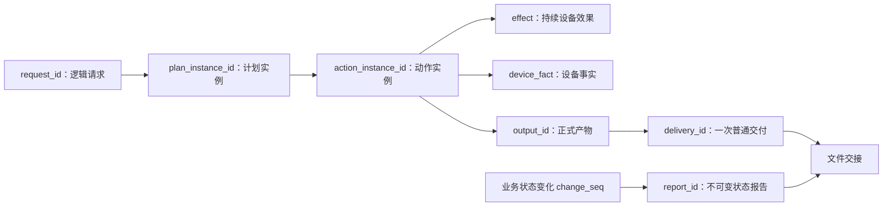

# camctl 设计总览

本总览定义系统范围、共同不变量和规格阅读入口。当前功能范围由以下专题规格共同描述；专题中的待确认事项须在对应行为实施前完成决策。文档边界表示契约归属，不预先固定代码模块或数据库表划分。

## 背景与角色

`camctl` 是运行在 ARM 嵌入式 Linux 板上的 Python CLI，负责控制相机和附属 MCU：

- 接收调用方生成的执行计划；
- 按计划调度设备操作；
- 管理设备通信；
- 在主机异常断电后恢复和对账遗留设备状态；
- 管理设备产生的数据产物；
- 将状态报告与调用方明确请求的产物发布到待传目录。

系统角色：

```text
调用方客户端
    │
    │ 生成执行计划 JSON
    ▼
主程序
    │
    │ Linux 主机上随开机自动运行的 C 程序
    │ 1. 接受外界输入并将计划文件路径交给 camctl，之后自行清理文件
    │ 2. 调用并管理 camctl run / submit 生命周期
    │ 3. 在现实条件允许的输出窗口处理 ready 目录中的文件并对外传输
    ▼
camctl CLI
    │
    │ 调度、设备控制、状态持久化、产物管理、报告生成
    ▼
受管设备
    ├── Camera
    └── MCU
```

### 主程序的集成边界

主程序由第三方维护，负责正确调用和管理 camctl 进程，以及中转输入文件、状态报告和产物文件。其消费的 CLI 结果用于判断会话是否正常结束，以及是否需要后续启动。

输入计划文件由主程序管理并在之后删除，具体删除时点对 camctl 不可知；文件不提供长期恢复保证。输入交接与恢复边界见[请求受理与会话](camctl/protocol-session.md#输入计划的保留责任)。

计划受理、动作执行和产物处理属于 camctl 与调用方客户端之间的业务。主程序按进程控制协议和文件交接协议工作，业务结果由 camctl 负责向客户端表达。

客户端保存待确认请求，通过状态报告确认受理；未获确认时使用相同 ID 和原计划内容重送。确认及重送规则见[请求受理与会话](camctl/protocol-session.md#客户端确认与重送)。

设计对接协议时，应尽量减少主程序需要实现的状态、消息解析和协调逻辑。业务新增或变化应由 camctl 与客户端承担相应处理。

主程序的异常进程有限重启能力属于待外部确认的[对接建议](camctl/protocol-session.md)，当前运行保障以会话规格中已经确认的启动入口为准。

主程序传输失败或中断后，文件残留在 `processing`；第三方是否再次处理这些文件未知。文件交接规则及其保障边界见[文件交接](camctl/file-handoff.md#processing)。

### 现实运行模型

主机运行于特殊环境中，供电和开机时间完全由现实条件临时决定，没有固定规律，也没有 camctl 或主程序能够预先知道的稳定运行时段。

因此，每次主机上电只意味着主程序和 camctl 获得了一段**长度未知的执行窗口**：

```text
现实条件决定主机供电
        ↓
Linux 启动
        ↓
主程序自动运行
        ↓
camctl 获得当前供电窗口内的执行机会
        ↓
主机可能在任意时刻直接断电
        ↓
下次上电后依据持久化状态恢复、对账、继续
```

主机是否有电、是否存在外界输入机会、是否存在外界输出机会，是三个彼此独立的现实条件：

```text
主机运行窗口
    ≠ 外界输入窗口
    ≠ 外界输出窗口
```

即使主机正在运行，也不代表主程序当前一定能够从外界获得新计划；同样也不代表当前适合将 `ready` 中的文件传输出去。

主程序负责：

> 外界 ↔ 主机

包括在不规则的现实窗口中接受外界输入和对外传输数据。

camctl 负责：

> 已持久化计划 ↔ 受管设备

以及将状态报告和明确请求的普通产物发布到 `ready`。camctl 不判断当前是否属于合适的外界通信窗口。

关键运行约束：

1. 主机不是持续供电，可以在任意时刻直接断电，无优雅关机。
2. Camera 与 MCU 独立供电，主机断电期间设备可以继续运行。
3. `camctl` 正常运行时假定受管设备已经上电。
4. `camctl` **不具有设备电源管理权限**，不负责上电、下电或断电重启。
5. 主程序在调用 `camctl` 前尝试同步系统时间，但 `camctl` 仍需验证时间可信性。
6. 主程序的数据传输成本较高，而且对外输出机会没有固定规律，因此文件进入待传目录后**不意味着立即传输**；主程序会等待现实条件允许的传输时机。
7. 外界输入同样只会在现实条件允许的不规则时间窗口内发生；主程序和 camctl 都不能预知下一次输入机会。

## 核心设计原则

### 先落盘，后产生设备副作用

需要恢复依据的状态必须在设备操作发出前持久化。

例如：

```text
pending
  ↓ 持久化
running
  ↓
发送设备指令
```

主机突然断电后，状态库必须能够判断哪些动作可能已经对设备产生过效果。

### 请求级幂等

调用方为每次逻辑计划提交生成稳定的 `request_id`。

```text
相同 request_id
    = 同一次逻辑请求的重试

新的 request_id
    = 新的执行意图
```

同一 `request_id` 永远以首次成功受理的内容为准，后续正文直接忽略。重复提交复用原计划及执行进度，ACK 独立处理；具体分区见[请求受理与会话](camctl/protocol-session.md#request_id)。

### 不同请求独立执行

两个不同 `request_id` 即使动作内容完全相同，也视为两个独立执行意图。单个 action 在通信重试、断电恢复中的幂等仍需按设备协议保证。

### 动作之间没有成功依赖

一个动作失败不自动阻止其他动作执行。

计划不提供：

```text
depends_on
```

等依赖图能力。

每个动作仅依据：

- 自身 `scheduled_at`；
- 自身时效窗口；
- 目标设备当前条件；
- 设备操作兼容性；
- 其他明确的自身执行条件；

决定是否执行。

### 不静默推断

不能证明的设备事实必须明确记录为未知或未确认。

例如：

```text
停止命令失败
≠
录像已经停止
```

## 专题规格与契约归属

| 专题 | 定义的行为 | 引用的共同边界 |
| --- | --- | --- |
| [请求受理与会话](camctl/protocol-session.md) | 命令、计划公共结构、幂等、会话接管、取消寻址、受理序列 | 报告 ACK 有效性、调度工作 |
| [调度与设备执行](camctl/scheduling-execution.md) | 动作状态、时间窗口、通信准备、设备兼容性、公共补偿、取消分派、时钟资格 | 受理序列、动作特有证据 |
| [相机录像](camctl/camera-recording.md) | 启动确认、时长、停止、恢复、核验、修复、录像取消 | 公共执行、正式产物 |
| [MCU 动作](camctl/mcu-actions.md) | 命令确认、当前值查询、结果产物 | 公共执行、正式产物 |
| [正式产物与取回清理](camctl/outputs.md) | output、普通 delivery、选择、取回、相机视频断点续传、文件名、清理、保留和重取 | 设备文件能力、文件交接 |
| [文件交接](camctl/file-handoff.md) | 目录所有权、原子发布、领取、撤回竞争及恢复 | 主程序协作 |
| [状态报告与累计确认](camctl/status-reports.md) | 业务变化水位、不可变快照、ACK、报告替换和补投 | 业务状态、请求入口、文件交接 |

每项契约只在责任专题中完整定义。其他专题说明输入、消费方式和链接；配置字段、持久化记录、验收要求和未决事项随责任专题维护。

## 对象关系



动作终态、设备事实、正式产物、普通交付和逻辑报告各有独立生命周期。报告表达业务状态；目录表达文件当前由哪一方处理。设备命令确认与客户端报告累计 ACK 是不同协议。

## 跨专题契约检查

| 端到端流程 | 要求与责任入口 |
| --- | --- |
| 提交 → 持久化 → 当前或后续会话 → 调度 | 成功受理的计划必须具有驱动责任；详见请求受理与会话 |
| 意图落盘 → 设备操作 → 结果未知 → 重启对账 → 收场 | 按公共执行规则保留未知事实，设备证据由动作专题定义 |
| 采集 → 产物登记 → 取回 → 发布 → 主程序领取 | 产物身份稳定、交付实例独立，领取后的文件由主程序处理 |
| 相机视频拷贝 → 主机断电 → 后续会话续传 | 保留可恢复的来源关联和拷贝进度，第一版支持跨主机重启续传；详见产物专题 |
| 删除意图 → 限制新取回 → 旧取回完成 → 删除/取消/重试 | 由产物专题定义资格与不可恢复边界，文件层遵循同一所有权规则 |
| 业务变化 → 报告快照 → 文件交接 → 客户端累计 ACK | 报告覆盖、不可变内容和补投由报告专题定义，提交入口消费 ACK 规则 |
| 取消寻址 → 动作收场或交付撤回 → 报告 | 寻址、业务取消与文件所有权分别遵守其责任专题；动作历史终态保持 |

每条流程都需要检查正常、失败、重试、断电恢复与取消路径。各专题分别通过验收不能代替这些流程的联合验证。

## 持久化与配置基础

使用单个 SQLite 数据库，采用事件溯源：不可变的历史变更是权威来源，当前状态是按历史计算的投影。每次状态变更都在同一数据库事务中追加历史并同步更新相关投影；业务处理可以查询已提交的当前投影，不能绕过历史直接修改业务状态。内存缓存可丢弃。请求、动作、效果、设备事实、产物、交付和报告的具体历史内容归各责任专题。

当前规格面向第一版，历史解释、投影计算和报告生成采用一套确定的数据格式与规则。验收范围是第一版内的写入、重启、回放和重建。

### 历史事件的粒度

一次具有独立含义的事实记录为一个事件。事件表达发生了什么，并携带重建所需的数据，例如计划已受理、录像启动已确认、某次停止尝试失败。事件边界由事实的含义决定；一个事件可以涉及多个字段，一次原子业务处理也可以包含多个事件。

是否追加历史按以下条件分类。状态变化包括业务状态和内部管理状态；恢复依据包括会改变后续判断的观察证据。

| 状态发生变化 | 新增恢复依据 | 影响报告重建 | 记录要求 |
| --- | --- | --- | --- |
| 是 | 任意 | 任意 | 追加历史，并同步更新相关投影 |
| 否 | 是 | 任意 | 追加观察事实，并同步更新相关投影 |
| 否 | 否 | 是 | 追加报告重建所需的事实，并同步更新相关投影 |
| 否 | 否 | 否 | 无需作为权威历史保存；普通调试输出按诊断日志规则处理 |

设备返回的状态值相同，也可能带来新的恢复依据，不能仅凭状态值相同省略观察事实。事件是否属于应报告的业务变化，继续按 `change_seq` 的分类判断。

事件保存当时已经确定的参数、策略、身份、结果及必要关联。回放按已定义的事件结构解释已记录事实，不重新运行当前业务决策来改写历史结果。操作意图、观察到的确认和结果未知各自表达独立事实；仅有意图时，不能补写没有证据支持的发送或成功结果。

一个事务可以提交多个事件，例如共同表达计划、全部动作和请求关联的受理事实；事务内事件仍遵守整体可见的历史边界规则。各专题负责定义具体事件类型、数据和成立条件。

### 历史边界与顺序

“保留每一时刻的状态”指能重建任一已提交事务边界上 camctl 已知的状态。同一事务内的全部变更整体可见，历史查询不能呈现只受理了一部分动作的计划。设备在 camctl 未观察期间发生的变化仍然未知，不能根据数据库历史推断其已成功或未发生。

历史采用不依赖墙钟的单调顺序，并保留事务分组。三个序列承担不同职责：

| 顺序 | 记录范围 | 用途 |
| --- | --- | --- |
| 全部历史变更的顺序 | 业务变更及内部管理变更 | 确定回放顺序和一致的历史边界 |
| `plan_seq` | 首次成功受理的新计划 | 发现新计划及定义受理顺序 |
| `change_seq` | 应报告的业务变化 | 确定状态报告的业务覆盖范围 |

有效 ACK 推进、报告自身的管理变化也记录历史，但不推进 `change_seq`；具体分类见[状态报告与累计确认](camctl/status-reports.md)。历史必须保存重建所需的事实，包括首次受理的结构化计划数据、状态转换、已确定的身份、当时采用的策略和观测结果。回放使用这些已记录的值；时间和配置变化不能改变既有事实。

### 事务、投影与回放

| 持久化情况 | 可用状态与处理 |
| --- | --- |
| 历史与相关投影一同提交成功 | 整个事务成为新的历史边界，后续处理可使用对应投影 |
| 写入失败且已确认回滚 | 历史与投影均不保留本次部分变化，沿用前一已提交状态 |
| 提交结果不确定 | 按会话错误处理；恢复时确认完整事务结果，不能断言未发生或重复产生业务实例 |
| 历史可靠，但投影缺失、落后或不一致 | 在使用该投影作业务决策前从历史重建并验证；完成前不能把它当作空状态 |
| 历史不可可靠读取或解释 | 保留诊断并停止依赖该状态的处理，不能生成猜测的投影 |

历史回放只计算状态，不发送设备命令、不发布交接文件、不删除文件，也不重新分配业务身份或产生新的业务变更。启动后的设备对账与任务恢复使用重建后的状态，按各专题规则进行新的观察和操作，再将新事实追加到历史。内核锁的当前归属仍由实际锁操作判断，历史不能授予会话接纳资格。

数据库与文件系统、设备之间的副作用需要明确可恢复的先后关系；历史中仅有操作意图不能证明外部操作已完成。单文件原子移动要求见文件交接专题；各动作的恢复证据见动作专题。

### 数据保留与派生文件

数据库数据永久保留，当前不设计删除或到期淘汰机制。历史只追加，已有事实保持不可变；后续变化追加新事实，投影据此更新。计划完成或退役、产物文件清理、交付文件删除及累计 ACK 推进，均不触发数据库记录删除。

执行计划 JSON 可由首次受理的结构化数据重建，重建保证已受理的计划语义，不要求复现输入文件的空白或字段排列。状态报告根据冻结的历史边界、覆盖水位和生成元数据，按第一版确定的生成规则重建；同一 `report_id` 的输出字节保持一致，详见[从历史重建报告](camctl/status-reports.md#从历史重建报告)。这些重建依据及身份关联永久保留。数据库之外的计划文件、产物文件和报告文件继续按各自文件生命周期处理；状态重建不恢复已清理的产物文件。

历史事件结构、事务分组与边界的表示、投影重建与并发访问的协调方式仍需细化。这些实现契约必须满足上述原子性、历史可解释性和回放无副作用的约束。

### 通用配置

通用配置建议：

| 字段 | 用途 |
| --- | --- |
| `paths.state_db` | 状态库路径 |
| `paths.log_file` | 日志文件路径 |
| `session.log_level` | 日志级别，当前建议值 `WARNING` |

交接目录配置见文件交接；时钟、设备和调度策略见调度与设备执行；录像恢复等待上限见相机录像。配置示例值与已确认行为约束分别标明。

## 依赖与部署

当前部署使用 Python 3.11、`pyserial`、`adb`、`ffmpeg` 和 `ffprobe`。其中 `adb` 是当前相机驱动的通信依赖；未来驱动按实际设备协议声明所需依赖，框架不要求所有相机提供 ADB 或 shell。视频修复采用无重新编码处理。设备独立供电，camctl 的控制范围是通信和业务操作；通信尝试耗尽后按对应动作结果处理。

## 阅读与完善顺序

1. 主程序和调用方协议：阅读请求受理与会话、文件交接、状态报告与累计确认。
2. 设备执行：阅读调度与设备执行，再阅读相机录像或 MCU 动作。
3. 数据管理：阅读正式产物与取回清理，并核对文件交接与状态报告。

后续完善优先闭合请求接管与文件交接，再细化调度及动作证据，随后闭合产物和报告状态机。真实设备协议尚未核实的保证需要在设备专题确认。

未决事项的权威入口：

| 专题 | 未决项标识 |
| --- | --- |
| 请求受理与会话 | U8 |
| 调度与设备执行 | U4、U7 |
| 相机录像 | U1、U6 |
| 状态报告与累计确认 | U3 |

各专题“待确认与待细化”还列出需要补齐的输入、状态分类与失败恢复契约。项目测试规范统一见根目录 [AGENTS.md](../../../AGENTS.md)；单元测试与集成测试的具体责任在各专题中列明。
