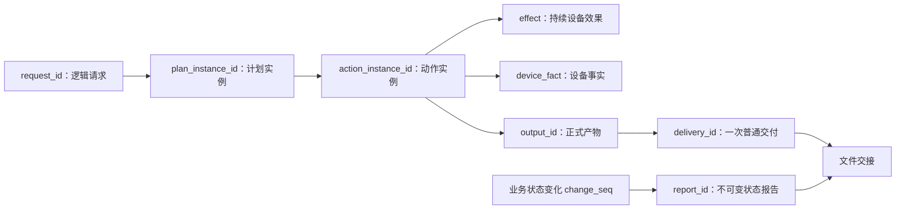

# camctl 设计总览

本总览定义系统范围、共同不变量和规格阅读入口。当前功能范围由以下专题规格共同描述；第一版按正常业务流程贯通各专题，影响业务结果的未明事项在对应功能落实时明确。文档边界表示契约归属，不预先固定代码模块或数据库表划分。

## 背景与角色

第一版以单台主机及其持久化数据库为运行范围，面向一个逻辑客户端维护累计报告确认。计划、动作、产物、交付和报告的身份及历史均在该范围内解释。客户端需要恢复完整状态时使用[完整状态同步](camctl/status-sync.md)，后续继续通过自动报告取得变化。

`camctl` 是运行在 ARM 嵌入式 Linux 板上的 Python CLI。第一版接入当前 ADB 相机的录像功能，并为其他拍摄能力、驱动参数类型和 MCU 预留设备与动作接入接口：

- 接收调用方生成的执行计划；
- 按计划调度设备操作；
- 管理设备通信；
- 在主机异常断电后恢复和对账遗留设备状态；
- 管理设备产生的数据产物；
- 将状态报告与调用方明确请求的产物发布到待传目录。

系统角色：

```text
调用方客户端
    │
    │ 用户在本地网页编辑计划并导出 JSON 文本
    ▼
负责消息传输的部门
    │
    │ 用户手工递交计划，传输部门负责送达主程序所在主机
    ▼
主程序
    │
    │ Linux 主机上随开机自动运行的 C 程序
    │ 1. 接受外界输入并将计划文件路径交给 camctl，之后自行清理文件
    │ 2. 调用并管理 camctl run / submit 生命周期
    │ 3. 在现实条件允许的输出窗口处理 ready 目录中的文件并对外传输
    ▼
camctl CLI
    │
    │ 调度、设备控制、状态持久化、产物管理、报告生成
    ▼
受管设备
    ├── Camera
    └── MCU（接口预留）
```

### 客户端的本地部署

客户端以易用性和易部署为目标，部署在用户的个人电脑上。采用本地后端配合浏览器网页的形式，通过 Docker 提供应用运行环境；用户通过 `localhost` 的本地端口访问界面。部署人员可以安装所需软件，负责准备 Docker 运行环境及应用部署包。

第一版客户端采用以下技术组合：

| 职责 | 选型与边界 |
| --- | --- |
| 浏览器界面 | TypeScript；提供计划编辑、文件选择、导出与状态展示 |
| 本地后端 | TypeScript，运行于 Node.js；处理客户端业务并提供构建后的前端网页资源 |
| 拍摄参数校验 | Ajv；浏览器与后端共用校验配置和错误转换代码，规则来自能力说明 |
| 客户端持久化 | SQLite；由后端保存客户端数据，并统一处理报告合并和累计确认进度 |
| 应用部署 | Docker Compose 管理单个应用容器；前端网页资源和后端随同一应用版本交付 |

固定的计划、报告和接口结构通过共享的 TypeScript 类型及相关代码保持一致。设备专属拍摄参数按部署时导入的 JSON Schema 在运行时校验；具体字段由驱动定义，遵守[拍摄参数的 JSON Schema](camctl/camera-recording.md#拍摄参数的-json-schema)。

拍摄参数以根据 Schema 生成的表单作为主要编辑入口，保留 JSON 编辑以处理复杂参数。两种编辑方式共用当前动作的完整参数和校验规则；正常流程、视图切换及导出前校验见[客户端计划编辑](camctl/client-editing.md)。

应用部署包包含后端、前端网页资源及所需运行时依赖。客户端的草稿、原请求、预设、已保存的报告状态和确认进度由本地后端管理，持久化数据与容器生命周期分开。部署目录内的 `data/` 通过目录挂载提供给容器，能力说明为 `data/device-capabilities.json`，客户端数据库为 `data/client.db`；重新创建或更新应用容器时继续使用原有数据。目录、启动加载与网页重新加载入口见[客户端部署与能力说明加载](camctl/client-deployment.md)。

客户端 Docker 应用运行在用户个人电脑上；下文的主程序和 camctl 运行在嵌入式 Linux 主机上，两者通过既定的人工交接和消息传输流程交换计划与报告。

### 客户端的人工交接流程

客户端以本地部署的网页提供计划编辑和报告导入界面。用户编辑并校验执行计划后，导出 JSON 文本，手工递交给负责消息传输的部门；该部门负责将计划送达主程序所在主机。主程序接收输入并将计划文件路径交给 camctl，具体传输方式由传输部门安排。

返回的状态报告由传输部门以 JSON 文件提供给用户。用户在网页上点击导入按钮并选择文件，客户端按[文件名与完整性校验](camctl/status-reports.md#文件名与完整性校验)及合并规则处理。交接报告时保留 camctl 发布的原文件名和原始字节，以便客户端使用文件名中的摘要完成核验。

| 用户已经完成的操作 | 可以确认的事实 | 后续处理 |
| --- | --- | --- |
| 导出计划并递交给传输部门 | 计划已完成本地编辑和人工递交 | 保留请求身份及原计划，等待报告确认受理 |
| 选择报告文件，但尚未完成校验和保存 | 客户端已经取得待处理文件 | 完成完整性校验、按实体 ID 合并和保存后，再判断可确认范围 |
| 报告校验通过，覆盖的状态已完整保存 | 客户端已经保存对应报告覆盖 | 后续导出的计划携带有效 `last_report_id`，仍由用户手工递交 |

待确认请求、累计 ACK 和重送继续遵守[客户端确认与重送](camctl/protocol-session.md#客户端确认与重送)。报告导入与 ACK 输入分别经过一次人工交接；在网页中完成导入不表示确认已经送达 camctl。能力说明使用部署时的[手工同步流程](camctl/camera-recording.md#部署时向客户端提供说明)。

### 主程序的集成边界

主程序由第三方维护，负责正确调用和管理 camctl 进程，以及中转输入文件、状态报告和产物文件。其消费的 CLI 结果用于判断会话是否正常结束，以及是否需要后续启动。

输入计划文件由主程序管理并在之后删除，具体删除时点对 camctl 不可知；文件不提供长期恢复保证。输入交接与恢复边界见[请求受理与会话](camctl/protocol-session.md#输入计划的保留责任)。

计划受理、动作执行和产物处理属于 camctl 与调用方客户端之间的业务。主程序按进程控制协议和文件交接协议工作，业务结果由 camctl 负责向客户端表达。

客户端保存待确认请求，通过状态报告确认受理；未获确认时使用相同 ID 和原计划内容重送。确认及重送规则见[请求受理与会话](camctl/protocol-session.md#客户端确认与重送)。

设计对接协议时，应尽量减少主程序需要实现的状态、消息解析和协调逻辑。业务新增或变化应由 camctl 与客户端承担相应处理。

主程序的异常进程有限重启能力属于待外部确认的[对接建议](camctl/protocol-session.md)，当前运行保障以会话规格中已经确认的启动入口为准。

主程序传输失败或中断后，文件残留在 `processing`；第三方是否再次处理这些文件未知。文件交接规则及其保障边界见[文件交接](camctl/file-handoff.md#processing)。

### 现实运行模型

主机运行于特殊环境中，供电和开机时间完全由现实条件临时决定，没有固定规律，也没有 camctl 或主程序能够预先知道的稳定运行时段。

因此，每次主机上电只意味着主程序和 camctl 获得了一段**长度未知的执行窗口**：

```text
现实条件决定主机供电
        ↓
Linux 启动
        ↓
主程序自动运行
        ↓
camctl 获得当前供电窗口内的执行机会
        ↓
主机可能在任意时刻直接断电
        ↓
下次上电后依据持久化状态恢复、对账、继续
```

主机是否有电、是否存在外界输入机会、是否存在外界输出机会，是三个彼此独立的现实条件：

```text
主机运行窗口
    ≠ 外界输入窗口
    ≠ 外界输出窗口
```

即使主机正在运行，也不代表主程序当前一定能够从外界获得新计划；同样也不代表当前适合将 `ready` 中的文件传输出去。

主程序负责：

> 外界 ↔ 主机

包括在不规则的现实窗口中接受外界输入和对外传输数据。

camctl 负责：

> 已持久化计划 ↔ 受管设备

以及将状态报告和明确请求的普通产物发布到 `ready`。camctl 不判断当前是否属于合适的外界通信窗口。

关键运行约束：

1. 主机不是持续供电，可以在任意时刻直接断电，无优雅关机。
2. Camera 与 MCU 独立供电，主机断电期间设备可以继续运行。
3. `camctl` 正常运行时假定受管设备已经上电。
4. `camctl` **不具有设备电源管理权限**，不负责上电、下电或断电重启。
5. 主程序在调用 `camctl` 前尝试同步系统时间，但 `camctl` 仍需验证时间可信性。
6. 主程序的数据传输成本较高，而且对外输出机会没有固定规律，因此文件进入待传目录后**不意味着立即传输**；主程序会等待现实条件允许的传输时机。
7. 外界输入同样只会在现实条件允许的不规则时间窗口内发生；主程序和 camctl 都不能预知下一次输入机会。

## 核心设计原则

### 先落盘，后产生设备副作用

需要恢复依据的状态必须在设备操作发出前持久化。

例如：

```text
pending
  ↓ 持久化
running
  ↓
发送设备指令
```

主机突然断电后，状态库必须能够判断哪些动作可能已经对设备产生过效果。

### 请求级幂等

调用方为每次逻辑计划提交生成稳定的 `request_id`。

```text
相同 request_id
    = 同一次逻辑请求的重试

新的 request_id
    = 新的执行意图
```

同一 `request_id` 永远以首次成功受理的内容为准，后续正文直接忽略。重复提交复用原计划及执行进度，ACK 独立处理；具体分区见[请求受理与会话](camctl/protocol-session.md#request_id)。

### 不同请求独立执行

两个不同 `request_id` 即使动作内容完全相同，也视为两个独立执行意图。单个 action 在通信重试、断电恢复中的幂等仍需按设备协议保证。

### 动作之间没有成功依赖

一个动作失败不自动阻止其他动作执行。

计划不提供：

```text
depends_on
```

等依赖图能力。

每个动作仅依据：

- 自身 `scheduled_at`；
- 自身时效窗口；
- 目标设备当前条件；
- 设备操作兼容性；
- 其他明确的自身执行条件；

决定是否执行。

### 不静默推断

不能证明的设备事实必须明确记录为未知或未确认。

例如：

```text
停止命令失败
≠
录像已经停止
```

## 专题规格与契约归属

| 专题 | 定义的行为 | 引用的共同边界 |
| --- | --- | --- |
| [首次部署与初始化](camctl/initialization.md) | 显式建库、目录准备、重复初始化及日常入口前提 | 用户级配置、状态持久化、会话锁与交接目录 |
| [执行计划输入契约](camctl/plan-input.md) | 公共字段、基本值类型、时间格式、动作入口及校验顺序 | 动作参数契约、受理事务、报告 ACK |
| [请求受理与会话](camctl/protocol-session.md) | 命令、原子受理、幂等、会话接管、取消寻址、受理序列 | 公共输入、报告 ACK 有效性、调度工作 |
| [会话错误与恢复边界](camctl/session-errors.md) | 会话错误标识、诊断、错误退出、应急停止与后续恢复 | 进程结果通道、动作与报告职责、设备归属 |
| [运行日志](camctl/logging.md) | 普通日志用途、配置、按大小轮换及文件保留上限 | 会话诊断、永久保留的业务历史 |
| [调度与设备执行](camctl/scheduling-execution.md) | 动作状态、时间窗口、通信准备、设备兼容性、公共补偿、取消分派、时钟资格 | 受理序列、动作特有证据 |
| [相机拍摄](camctl/camera-recording.md) | 拍摄能力、驱动参数类型；当前 ADB 相机录像的启动、时长、停止、恢复、修复与取消 | 公共执行、正式产物 |
| [当前相机录像参数](camctl/camera-parameters.md) | 普通录像参数组织、曝光分支及设备参数定义 | 驱动能力、同源 Schema、录像执行 |
| [能力说明格式](camctl/capabilities.md) | 设备、拍摄动作、参数类型及 Schema 的导出字段与对应关系 | 驱动定义、能力说明交接与整份加载 |
| [客户端计划编辑](camctl/client-editing.md) | 拍摄参数表单、JSON 编辑、参数保留及导出前校验 | 能力说明、计划输入、人工交接 |
| [客户端部署与能力说明加载](camctl/client-deployment.md) | 客户端目录、Docker 持久化、启动与手动加载及结果分区 | 能力说明格式、整份加载、客户端数据 |
| [MCU 接口预留](camctl/mcu-actions.md) | 第一版扩展边界、未实现动作的受理结果、后续接入依据 | 公共执行、正式产物 |
| [正式产物与取回清理](camctl/outputs.md) | output、普通 delivery、选择、取回、相机视频断点续传、文件名、清理、保留和重取 | 设备文件能力、文件交接 |
| [文件交接](camctl/file-handoff.md) | 目录所有权、原子发布、领取、撤回竞争及恢复 | 主程序协作 |
| [状态报告与累计确认](camctl/status-reports.md) | 业务变化水位、不可变快照、ACK、报告替换和补投 | 业务状态、请求入口、文件交接 |
| [客户端完整状态同步](camctl/status-sync.md) | 完整同步入口、持久化责任、合格 ACK、恢复后的增量衔接 | 单客户端累计 ACK、报告覆盖与文件交接 |

每项契约只在责任专题中完整定义。其他专题说明输入、消费方式和链接；配置字段、持久化记录、验收要求和未决事项随责任专题维护。

客户端对接可结合[客户端协议样例](camctl/client-protocol-examples.md)阅读：样例提供正常成功、单动作参数错误、组取回部分失败和来源无产物的完整 JSON，以及 ACK 输入和增量合并结果。

部署对接可结合[首次部署与联调样例](camctl/deployment-example.md)阅读：样例提供通用配置覆盖和无设备报告检查计划，串联初始化、能力说明的手工交接、主程序调用及客户端报告确认。

相机以拍摄能力、驱动参数类型和拍摄参数表达一次拍摄要求。设备可以支持单张照片、录像、延时摄影中的任意一种或多种能力，后续可扩展；每种能力可有一种或多种设备专属参数类型。客户端将用户预设展开成明确计划后提交，camctl 不管理用户预设。参数及执行契约见[拍摄能力与参数类型](camctl/camera-recording.md#拍摄能力与参数类型)。

## 对象关系



动作终态、设备事实、正式产物、普通交付和逻辑报告各有独立生命周期。报告表达业务状态；目录表达文件当前由哪一方处理。设备命令确认与客户端报告累计 ACK 是不同协议。

## 第一版正常流程

本流程以单台主机、当前 ADB 相机为对象，假设输入合法、主机时间可信、通信正常且存储空间充足。[采集与取回计划示例](camctl/protocol-session.md#基本结构)使用样例驱动参数演练业务链；真实设备验收使用依据实际相机能力另行确定的正式参数类型。

| 步骤 | 谁执行什么 | 可观察结果 |
| --- | --- | --- |
| 1. 交给 CLI | 主程序调用 `run <plan-path>`；运行期间的新输入通过 `submit` 交接 | 一份计划及其全部动作原子受理，同请求重送复用原实例 |
| 2. 按时录像 | camctl 在启动窗口内调用相机；成功确认后计时，到目标时长停止 | 正常录像完成，源视频保留在相机；产物登记与录像终态同时提交 |
| 3. 取回产物 | 取回动作到时间后选择正式产物，拷贝到自己在 `staging` 中的工作文件 | 独立 delivery；文件准备完成，保存大小、摘要和最终文件名 |
| 4. 本地发布 | camctl 将准备好的文件发布到 `ready`，并生成覆盖业务结果的状态报告 | 取回成功；全部动作结束后计划 `completed` |
| 5. 中转文件 | 主程序把 `ready` 文件移到 `processing`，传输后删除本地传输副本 | 客户端收到报告和交付文件，两者可以先后到达 |
| 6. 接受并确认 | 客户端核验报告、确认累计覆盖并保存状态，通过后续输入确认报告；视频按报告中的文件名、大小与摘要另行关联和核验 | 报告确认水位推进；相机原片仍保留 |
| 7. 按需清理 | 客户端用新计划显式清理已不需要的 `output_id` | 删除对应正式源文件，数据库保留全部业务历史 |

普通文件交付名使用 `<delivery_id>.<ext>`，完整可读名称通过报告的 `display_name` 展示。报告确认不等于普通视频已收到；源视频是否删除由客户端的显式清理请求决定。

### 第一版完善与验收范围

当前先形成 MVP（最小可行版本），验证计划生成、CLI 受理与调度、产物取回、文件交接及客户端报告处理的软件流程。相机尚未到位时使用受驱动契约约束的相机替身，配合真实 CLI、SQLite、交接目录与客户端进行集成验证；已有样例参数用于协议演练，不据此宣称真实相机支持相应配置。主程序和传输环节可按已约定的职责进行测试代行，实际对接仍需第三方联调。

相机到位后，完成真实驱动命令、设备响应和实际文件的联调验收。拍摄参数优先覆盖用于验证的任务，已确定的固定设置由驱动执行；更多设备参数选项在完整交接后细调，沿用现有扩展接口。当前参数范围见[当前相机录像参数](camctl/camera-parameters.md)。

先使上述主流程完整可运行，再覆盖会改变正常使用结果的必要分支：同一请求重送、已支持动作自身参数错误、设备尝试耗尽、取消、启动窗口过期、取回断点续传及报告确认。已有规则继续作为这些分支的边界。

| 工作 | 第一版落实方式 |
| --- | --- |
| 业务与文件主流程 | 按上表交付一条贯通计划、驱动、数据库、文件和客户端报告的集成场景 |
| 数据持久化 | 保持已确认的历史与投影原子提交、身份稳定及重启恢复要求 |
| 实现细节 | 字段编码、表划分、命令封装及测试组织在对应功能实现时确定 |
| 真实相机接入 | 依据设备能力完成正式拍摄参数规格、驱动命令映射及主流程联调；驱动替身通过不代表真实设备已经验收 |
| 后续设计讨论 | 实现中出现无法由现有规则确定、且影响业务结果的情况时，再补齐该具体契约 |

## 跨专题契约检查

| 端到端流程 | 要求与责任入口 |
| --- | --- |
| 提交 → 持久化 → 当前或后续会话 → 调度 | 成功受理的计划必须具有驱动责任；详见请求受理与会话 |
| 意图落盘 → 设备操作 → 结果未知 → 重启对账 → 收场 | 按公共执行规则保留未知事实，设备证据由动作专题定义 |
| 采集 → 产物登记 → 取回 → 发布 → 主程序领取 | 产物身份稳定、交付实例独立，领取后的文件由主程序处理 |
| 相机视频拷贝 → 主机断电 → 后续会话续传 | 保留可恢复的来源关联和拷贝进度，第一版支持跨主机重启续传；详见产物专题 |
| 删除意图 → 限制新取回 → 旧取回完成 → 删除/取消/重试 | 由产物专题定义资格与不可恢复边界，文件层遵循同一所有权规则 |
| 业务变化 → 报告快照 → 文件交接 → 客户端累计 ACK | 报告覆盖、不可变内容和补投由报告专题定义，提交入口消费 ACK 规则 |
| 取消寻址 → 动作收场或交付撤回 → 报告 | 寻址、业务取消与文件所有权分别遵守其责任专题；动作历史终态保持 |

每条流程都需要检查正常、失败、重试、断电恢复与取消路径。各专题分别通过验收不能代替这些流程的联合验证。

## 持久化与配置基础

使用单个 SQLite 数据库，采用事件溯源：不可变的历史变更是权威来源，当前状态是按历史计算的投影。每次状态变更都在同一数据库事务中追加历史并同步更新相关投影；业务处理可以查询已提交的当前投影，不能绕过历史直接修改业务状态。内存缓存可丢弃。请求、动作、效果、设备事实、产物、交付和报告的具体历史内容归各责任专题。

状态库在首次部署时通过 [`camctl init`](camctl/initialization.md) 显式创建。日常 `run` / `submit` 只打开已有合法状态库，缺失或无效时报错，不自动创建空历史。

当前规格面向第一版，历史解释、投影计算和报告生成采用一套确定的数据格式与规则。验收范围是第一版内的写入、重启、回放和重建。

### 历史事件的粒度

一次具有独立含义的事实记录为一个事件。事件表达发生了什么，并携带重建所需的数据，例如计划已受理、录像启动已确认、某次停止尝试失败。事件边界由事实的含义决定；一个事件可以涉及多个字段，一次原子业务处理也可以包含多个事件。

是否追加历史按以下条件分类。状态变化包括业务状态和内部管理状态；恢复依据包括会改变后续判断的观察证据。

| 状态发生变化 | 新增恢复依据 | 影响报告重建 | 记录要求 |
| --- | --- | --- | --- |
| 是 | 任意 | 任意 | 追加历史，并同步更新相关投影 |
| 否 | 是 | 任意 | 追加观察事实，并同步更新相关投影 |
| 否 | 否 | 是 | 追加报告重建所需的事实，并同步更新相关投影 |
| 否 | 否 | 否 | 无需作为权威历史保存；普通调试输出按诊断日志规则处理 |

设备返回的状态值相同，也可能带来新的恢复依据，不能仅凭状态值相同省略观察事实。事件是否属于应报告的业务变化，继续按 `change_seq` 的分类判断。

事件保存当时已经确定的参数、策略、身份、结果及必要关联。回放按已定义的事件结构解释已记录事实，不重新运行当前业务决策来改写历史结果。操作意图、观察到的确认和结果未知各自表达独立事实；仅有意图时，不能补写没有证据支持的发送或成功结果。

一个事务可以提交多个事件，例如共同表达计划、全部动作和请求关联的受理事实；事务内事件仍遵守整体可见的历史边界规则。各专题负责定义具体事件类型、数据和成立条件。

### 历史边界与顺序

“保留每一时刻的状态”指能重建任一已提交事务边界上 camctl 已知的状态。同一事务内的全部变更整体可见，历史查询不能呈现只受理了一部分动作的计划。设备在 camctl 未观察期间发生的变化仍然未知，不能根据数据库历史推断其已成功或未发生。

历史采用不依赖墙钟的单调顺序，并保留事务分组。三个序列承担不同职责：

| 顺序 | 记录范围 | 用途 |
| --- | --- | --- |
| 全部历史变更的顺序 | 业务变更及内部管理变更 | 确定回放顺序和一致的历史边界 |
| `plan_seq` | 首次成功受理的新计划 | 发现新计划及定义受理顺序 |
| `change_seq` | 应报告的业务变化 | 确定状态报告的业务覆盖范围 |

有效 ACK 推进、报告自身的管理变化也记录历史，但不推进 `change_seq`；具体分类见[状态报告与累计确认](camctl/status-reports.md)。历史必须保存重建所需的事实，包括首次受理的结构化计划数据、状态转换、已确定的身份、当时采用的策略和观测结果。回放使用这些已记录的值；时间和配置变化不能改变既有事实。

### 事务、投影与回放

| 持久化情况 | 可用状态与处理 |
| --- | --- |
| 历史与相关投影一同提交成功 | 整个事务成为新的历史边界，后续处理可使用对应投影 |
| 写入失败且已确认回滚 | 历史与投影均不保留本次部分变化，沿用前一已提交状态 |
| 提交结果不确定 | 按会话错误处理；恢复时确认完整事务结果，不能断言未发生或重复产生业务实例 |
| 历史可靠，但投影缺失、落后或不一致 | 在使用该投影作业务决策前从历史重建并验证；完成前不能把它当作空状态 |
| 历史不可可靠读取或解释 | 保留诊断并停止依赖该状态的处理，不能生成猜测的投影 |

历史回放只计算状态，不发送设备命令、不发布交接文件、不删除文件，也不重新分配业务身份或产生新的业务变更。启动后的设备对账与任务恢复使用重建后的状态，按各专题规则进行新的观察和操作，再将新事实追加到历史。内核锁的当前归属仍由实际锁操作判断，历史不能授予会话接纳资格。

数据库与文件系统、设备之间的副作用需要明确可恢复的先后关系；历史中仅有操作意图不能证明外部操作已完成。单文件原子移动要求见文件交接专题；各动作的恢复证据见动作专题。

### 数据保留与派生文件

数据库数据永久保留，当前不设计删除或到期淘汰机制。历史只追加，已有事实保持不可变；后续变化追加新事实，投影据此更新。计划完成、产物文件清理、交付文件删除及累计 ACK 推进，均不触发数据库记录删除。

执行计划 JSON 可由首次受理的结构化数据重建，重建保证已受理的计划语义，不要求复现输入文件的空白或字段排列。状态报告根据冻结的历史边界、覆盖水位和生成元数据，按第一版确定的生成规则重建；同一 `report_id` 的输出字节保持一致，详见[从历史重建报告](camctl/status-reports.md#从历史重建报告)。这些重建依据及身份关联永久保留。数据库之外的计划文件、产物文件和报告文件继续按各自文件生命周期处理；状态重建不恢复已清理的产物文件。

历史事件结构、事务分组与边界的表示、投影重建与并发访问的协调方式仍需细化。这些实现契约必须满足上述原子性、历史可解释性和回放无副作用的约束。

### 通用配置

执行计划指定业务要求，本地设备配置提供通信尝试上限、超时和重试间隔，执行计划不覆盖通信策略。配置归属与受理时固化规则见[计划要求与本地通信配置](camctl/scheduling-execution.md#计划要求与本地通信配置)。

本地配置使用 TOML，默认读取 `$HOME/.camctl/config.toml`，可用 `--config <path>` 选择另一份文件。所有本地配置项均有内置默认值，配置文件只覆盖所提供的字段；文件不存在时使用默认配置。路径选择、覆盖和错误处理由[本地配置的加载与更新](camctl/scheduling-execution.md#本地配置的加载与更新)定义。

第一版由部署流程在停止 CLI 调用并确认已有进程退出后更新本地配置，下次启动加载；已有动作沿用首次受理时保存的配置。加载、更新及生效范围见[本地配置的加载与更新](camctl/scheduling-execution.md#本地配置的加载与更新)。

通用配置的默认值：

| 字段 | 默认值 | 用途 |
| --- | --- | --- |
| `paths.state_db` | `$HOME/.camctl/state.db` | 状态库路径 |

这里的默认路径以本次 CLI 进程的用户主目录计算，不随工作目录变化；日常 `run` / `submit` 与部署导出须使用对应部署的用户目录和生效配置。交接目录的用户级默认路径见[文件交接配置](camctl/file-handoff.md#配置归属)；时钟、设备和调度策略见调度与设备执行；录像的恢复等待上限见相机拍摄。

普通运行日志按大小轮换，自动淘汰超出保留数量的最旧文件；日志路径、级别、轮换阈值和总份数的默认值由[运行日志配置](camctl/logging.md#配置与默认值)定义。普通日志用于近期排障，数据库历史继续永久保留。

## 依赖与部署

第一版主机部署使用 Python 3.11、`adb`、`ffmpeg` 和 `ffprobe`。其中 `adb` 是当前相机驱动的通信依赖；相机端不增加依赖，工具及文件处理边界见[通信方式与查询能力](camctl/camera-recording.md#通信方式与查询能力)。未来驱动按实际设备协议声明所需依赖，框架不要求所有相机提供 ADB 或 shell。MCU 仅预留接口，本版不要求 `pyserial` 等 MCU 通信依赖。视频修复采用无重新编码处理。设备独立供电，camctl 的控制范围是通信和业务操作；通信尝试耗尽后按对应动作结果处理。

首次部署先确定生效配置，由用户或部署人员执行 [`camctl init`](camctl/initialization.md)，成功后再启动主程序的日常 `run` / `submit` 调用。配置文件可以不存在，初始化仍可使用默认值；重复初始化验证已有合法状态库并保留数据。

首次部署、更换相机或调整设备绑定、修改驱动参数契约时，由部署流程将对应的能力及参数说明同步给客户端。说明从实际驱动定义和主机设备配置生成，客户端成功加载后用于生成计划；内容与责任见[部署时向客户端提供说明](camctl/camera-recording.md#部署时向客户端提供说明)。

部署人员使用 [`camctl describe`](camctl/protocol-session.md#describe) 导出一份内含 JSON Schema 的完整 JSON 说明，字段按[设备、拍摄动作、参数类型](camctl/capabilities.md)组织。该入口只读取本地配置及驱动定义，不要求相机在线或已有业务状态库；成功后由用户手工复制覆盖客户端部署目录中的 `data/device-capabilities.json`。客户端通过[启动或网页重新加载](camctl/client-deployment.md#启动与重新加载)完整校验后启用，整体更新用于生成新计划的能力目录。

拍摄参数的静态约束使用 [JSON Schema](camctl/camera-recording.md#拍摄参数的-json-schema) 表达，camctl 受理校验与客户端校验使用同源规则；设备状态及执行资格由运行时判断。

## 阅读与完善顺序

1. 主程序和调用方协议：阅读请求受理与会话、文件交接、状态报告与累计确认。
2. 设备执行：阅读调度与设备执行、相机拍摄，以及 MCU 接口预留边界。
3. 数据管理：阅读正式产物与取回清理，并核对文件交接与状态报告。

后续完善优先闭合请求接管与文件交接，再细化调度及动作证据，随后闭合产物和报告状态机。真实设备协议尚未核实的保证需要在设备专题确认。

第一版已确定的配置与设备边界：

| 事项 | 第一版约定 | 权威位置 |
| --- | --- | --- |
| 异常恢复等待 | 默认 60 秒，可配置；等待 `min(duration_s, recovery_wait_cap_s)` | [相机配置](camctl/camera-recording.md#配置归属) |
| 异常多录余量 | 本地配置 `devices.<id>.recording.repair_margin_s`；严格超过目标时长与余量之和才触发修复 | [相机配置](camctl/camera-recording.md#配置归属) |
| 调度提前唤醒 | `session.wakeup_margin_ms` 默认 50ms，可配置；0 关闭，不提前执行动作 | [唤醒决策](camctl/scheduling-execution.md#唤醒后的统一重新决策) |
| 新计划发现 | `plan_seq`、`latest_plan_seq`、`last_seen_plan_seq` | [受理序列](camctl/protocol-session.md#新计划受理序列) |
| 当前相机接入 | 使用已确认的 ADB/Linux 能力；厂商命令映射和正常响应作为真实驱动联调输入 | [驱动接入契约](camctl/camera-recording.md#第一版驱动接入契约) |

各专题的实现细节在对应流程落地时细化。项目测试规范统一见根目录 [AGENTS.md](../../../AGENTS.md)；先完成第一版正常流程及其必要失败处理，再验证既有断电与恢复契约。真实设备命令映射和联调仍是设备验收的前提。
